## Computing Machinery and Intelligence

What is intelligence? Can we build intelligence into a machine? 

This idea of thinking and of being an intelligence agent is thoroughly examined by **Alan Turing**[^1] in his paper, published in the *Mind* philosophy journal, which talks about how to build these machines.
His very old and interesting paper is about the ***Turing Test***, originally called the ***Imitation Game***, which consists in testing if a machine can actually think and reason like a human:

<iframe src="papers/1__1__Computing_Machinery_and_Intelligence.pdf" width="100%" height="400px"></iframe>

<em>-- I propose to consider the question, "Can machines think?" This should begin with definitions of the meaning of the terms "**machine**" and "**think**". --</em>

[^1]: *Alan Turing (1912 – 1954):* [https://it.wikipedia.org/wiki/Alan_Turing](https://it.wikipedia.org/wiki/Alan_Turing)

    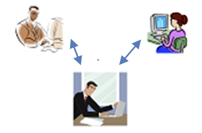

In proposing his question-answer test Turing (1950) introduced the idea through a ***Gender Imitation Game*** The experiment involves a computer and a human pretending to be the opposite gender.

In this game a human interrogator of either sex simultaneously questions two hidden interlocutors: one man and one woman. The purpose of the man is to pretend to be a woman; the woman's task is to tell the truth. The interrogator must determine the actual woman. Replacing one of the hidden interlocutors with a machine Turing asked:

> "May not machines carry out something which ought to be described as thinking but which is very different from what a man does?"

Turing quite rightly raised that question realising after WWII that man does not think like every other man; man does think like woman; an Occidental woman may not think like a woman from the Orient.

Gender is regarded as an important feature in Turing's game by some (Copeland & Proudfoot 2008; Sterrett, 2000; Lassègue, 1996; Hayes & Ford, 1995; Genova, 1994). The contention is that both man and machine impersonating a woman provides a stronger test for intelligence. However, neither of these researchers have explained what they mean by *gender* nor have they provided empirical evidence to substantiate their claim.[^2]

[^2]: Source: Shah, H., & Warwick, K. (2016). *Imitating Gender as a Measure for Artificial Intelligence: - Is It Necessary?*. In Proceedings of the 8th International Conference on Agents and Artificial Intelligence - Volume 1: ICAART (pp. 126-131). SCITEPRESS. [https://www.scitepress.org/papers/2016/56739/56739.pdf](https://www.scitepress.org/papers/2016/56739/56739.pdf)

## Intelligent Machines Evolution

However, the idea of building a mechanical machine capable of thinking --making decisions and executing operations based on a program-- was originally proposed one century earlier (1850) by computer pioneer **Charles Babbage**[^3] with his Analytical Engine. From this invention, we progressed to modern computers: autonomous systems acting independently, on par with or even surpassing human abilities (e.g. self-driving cars).

[^3]: *Charles Babbage (1791 – 1871):* [https://en.wikipedia.org/wiki/Charles_Babbage](https://en.wikipedia.org/wiki/Charles_Babbage)

    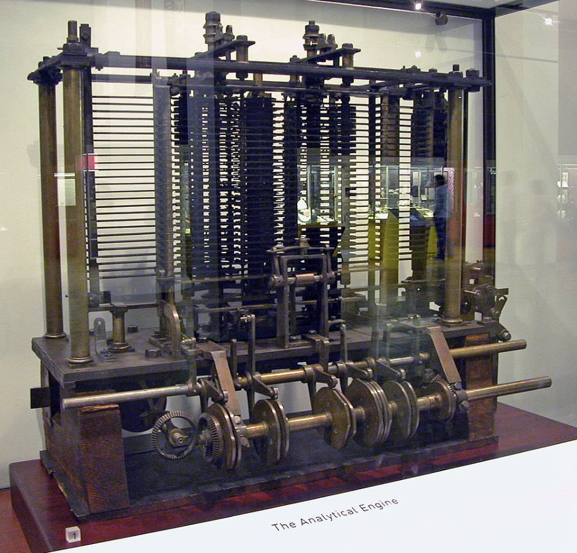
    $\rightarrow$
    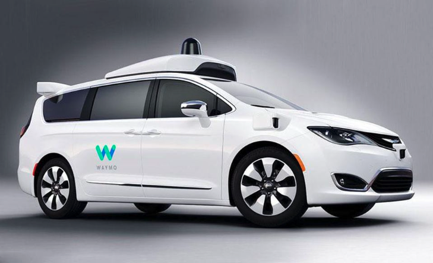

    <em>From [The Analytical Engine](https://en.wikipedia.org/wiki/Analytical_engine) to [Autonomous Systems](https://www.youtube.com/watch?v=B8R148hFxPw).</em>

    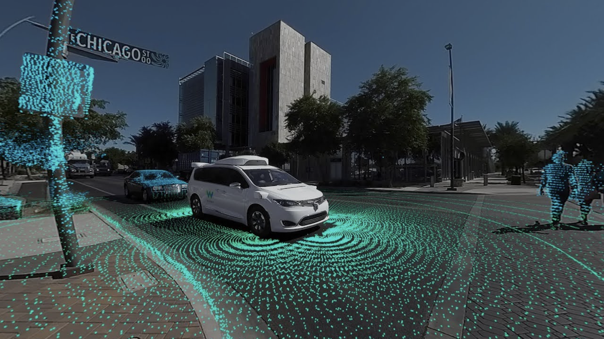

The key point is that modern machines operate within an **environment**, such as a car's physical surroundings. Within this environment, we have the **agent**, the self-driving car. By observing its surroundings, the agent determines the **state** of the world (the environment). It then takes **actions** and learns from **experience** to improve its performance.

One approach to achieving this involves ***trial and error***  learning : driving --initially in a purely random way-- while receiving feedback from a human driver, enabling the system to gradually refine its behavior. The reward is proportional to the travelled distance.

    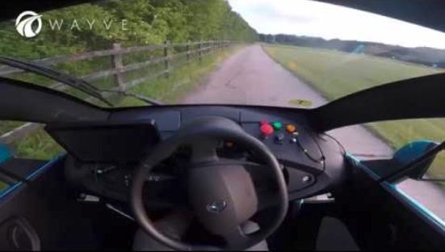
     
    <em>[Wayve experiment](https://youtu.be/eRwTbRtnT1I?si=DtKCJMpXs6DXqRXf): Reinforcement Learning algorithm learning to drive a car.</em>

## AI Systems Mastering Games with Reinforcement Learning

As previously discussed, this module explores AI systems that interact with and operate within their environments. Without relying on logic rules, these systems learn —whether how to drive a car, how to play video games or how to walk— from the *observations*, the *states*, so from what they observe (e.g. pixels, images, etc.). These algorithms are driven purely by reinforcement learning, without any human data, guidance or domain knowledge.

- **Input**: the pixels and the reward (e.g. game score).
- **Goal**: learn how to drive/play/walk from scratch, with no prior knowledge.

The systems learn through **trial and error**, balancing **exploration** and **exploitation** to refine their behaviour over time.

<h3>Ms. Pac-Man</h3>

For example, in Ms. Pac-Man, we wouldn't know which character is a ghost, which one is Miss Pac-Man, or where the cherry is. Instead, we learn everything simply by analyzing the pixels on the screen.

    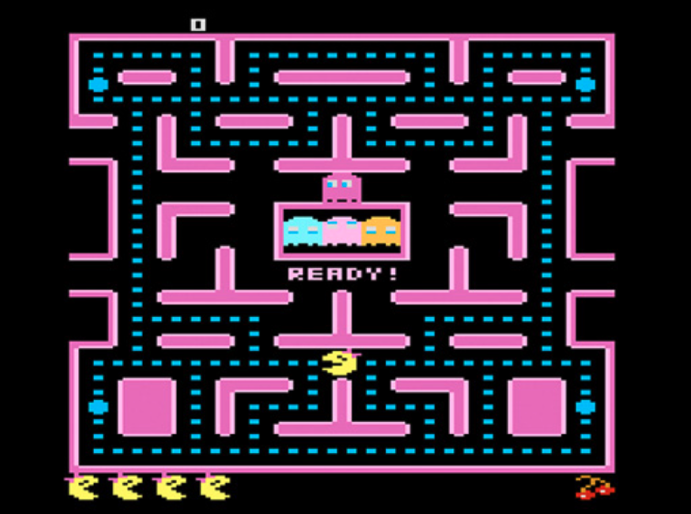

<h3>Atari 2600 games</h3>

Atari games were solved with Deep Reinforcement Learning (DRL) using a method called Deep Q-Network (DQN), which was introduced by researchers at DeepMind in 2013 (and a more detailed version of the research was later published in the *Nature* journal in 2015). This approach revolutionized the way AI systems could learn to play video games.

     
    <em>210 $\times$ 160 pixel image frames with 128 colours at 60Hz.</em>
    

<iframe src="papers/1__2__Playing_Atari_with_Deep_Reinforcement_Learning.pdf" width="100%" height="400px"></iframe>

<em>[youtu.be/rFwQDDbYTm4?si=ozHD2X8AwNt398xw](https://youtu.be/rFwQDDbYTm4?si=ozHD2X8AwNt398xw)</em>

    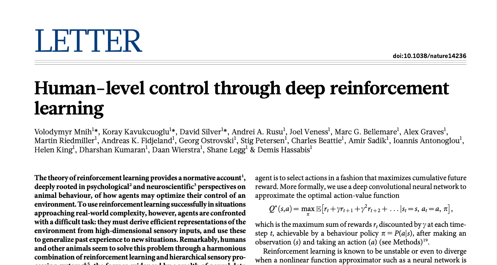

<h3>The game of Go</h3>

The game of Go was solved in 2016 using Deep Reinforcement Learning as well, but in a more sophisticated manner compared to Atari games. This was achieved by DeepMind's AlphaGo and its subsequent versions (AlphaGo Zero, AlphaZero), which used a combination of Deep Neural Networks and Reinforcement Learning techniques to master the game.

    
     
    <em>$19 \times 19$</em>

    
     
    <em>Configurations of Go.</em>

The AlphaGo paper is particularly intriguing because Go is an exceptionally complex game. Played on a $19 \times 19$ board, where each tile can be empty, white, or black, the total number of possible valid configurations —*possible states*— is approximately $10^{170}$, excluding impossible ones. And given that the number of atoms in the observable universe is $10^{80}$, this highlights the immense complexity of that game: there are more configurations of Go than atoms in the universe.

    [Google DeepMind: Ground-breaking AlphaGo masters the game of Go](https://youtu.be/SUbqykXVx0A?si=OrAButW_JbefDYV8)

In **AlphaGo**, the model was pretrained using experience from previous games. AlphaGo plays agains itself (its old copy) becoming better and better alone, without needing any input for playing.

    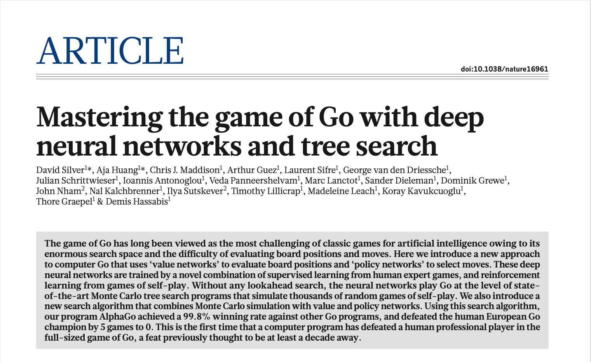

In contrast, **AlphaGo Zero** learned to play Go entirely from scratch ("*tabula rasa*""), from literally random play, without any prior knowledge (zero prior knowledge) of the game —that's why it's the zero in the name. Despite this, it quickly achieved superhuman performance, discovering solutions and completely novel ways of playing never saw before.

While AlphaGo could only play Go, AlphaZero can play any two-game player game.

**Demis Hassabis**, the founder of DeepMind, once said: 
*"We left our AlphaZero just playing lunchtime and it became better than each chess player in the world."*

[Demis Hassabis describes how **AlphaZero**, starting from scratch, became "the greatest Chess playing entity that's ever existed" ***in only 9 hours***.](https://x.com/tsarnick/status/1785050900647862683)

    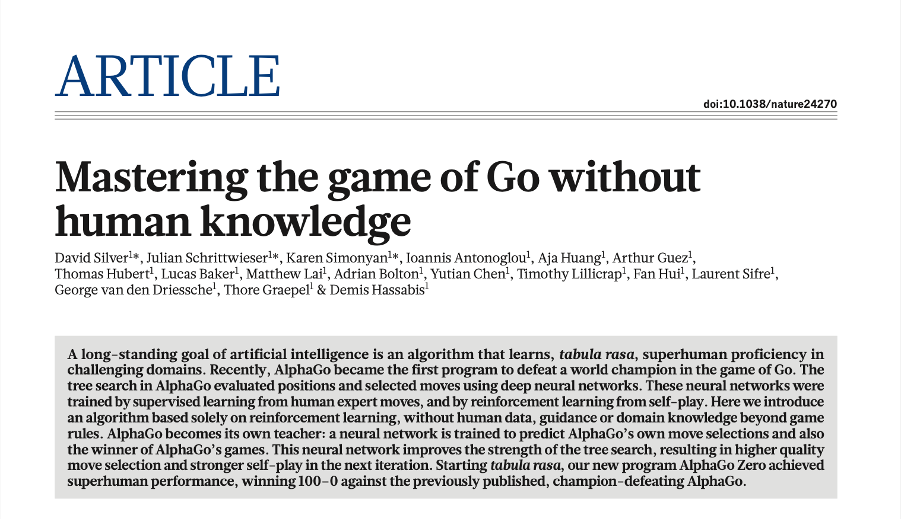

<h3>StarCraft</h3>

In 2020, DeepMind achieved a major AI breakthrough by mastering StarCraft using only pixel-based input. This is an especially complex game, as it requires strategic planning and coordination between multiple agents within the system. **AlphaStar**, DeepMind's AI, went on to compete against top human players, winning high-level competitions and demonstrating superhuman performance.

    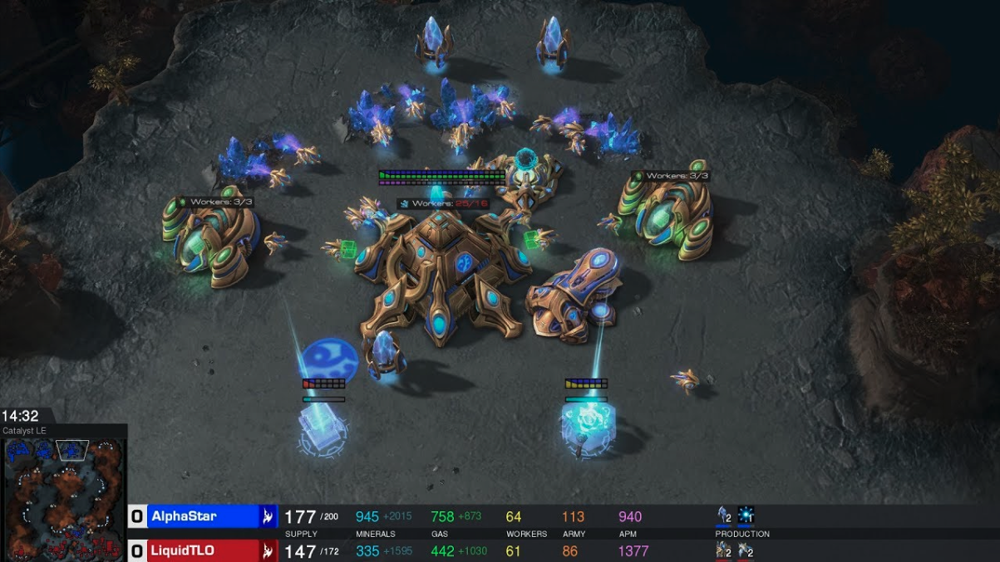
     
    <em>[youtu.be/6EQAsrfUIyo?si=gUXbT-NVSvlvSco6](https://youtu.be/6EQAsrfUIyo?si=gUXbT-NVSvlvSco6)</em>

<h3>Poker</h3>

AI has made significant breakthroughs also in poker, a game that is particularly challenging for machines due to its *incomplete information*, meaning players don’t have full knowledge of the game state (unlike chess or Go).

**DeepStack** was a groundbreaking AI developed by the University of Alberta, Charles University, and Czech Technical University. It was the first AI to beat professional human players in heads-up no-limit Texas hold'em.

    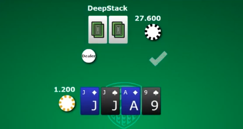
     
    <em>[youtu.be/SI-i-fQBv1Y?si=17Mh4EWnD5ofqdFN](https://youtu.be/SI-i-fQBv1Y?si=17Mh4EWnD5ofqdFN)</em>

<iframe src="papers/1__3__DeepStack_Expert-Level_Artificial_Intelligence_in_Heads-Up_No-Limit_Poker.pdf" width="100%" height="400px"></iframe>

## Real-World Applications of Agentic Systems

Reinforcement learning algorithms can be described as **decision-making algorithms** or **agentic systems**, as they are designed to autonomously make decisions and take actions based on their environment. Let's see some real-world applications of them.

<h3>🦿 Robotics: Learning how to walk</h3>

One of the most fascinating applications of reinforcement learning in robotics is enabling machines to walk autonomously. Instead of being programmed with predefined motion rules, these AI-driven systems learn purely from experience. By receiving only sensor readings —such as joint positions and balance data— the robot explores and refines its movements through trial and error.

A great example of this can be seen in DeepMind's research, where an AI-controlled robot learns to walk from scratch. With no prior knowledge of physics or locomotion, the system gradually discovers stable and efficient ways to move, adapting dynamically to different terrains.

    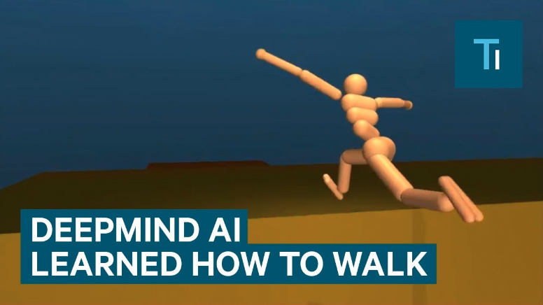
     
    <em>[youtu.be/gn4nRCC9TwQ?si=Sw2HOFkXfOHQf4Qc](https://youtu.be/gn4nRCC9TwQ?si=Sw2HOFkXfOHQf4Qc)</em>

<h3>⚡️ Cloud Farms: Optimizing Energy and Load Distribution</h3>

    

Agentic systems are widely used in cloud farms to optimize resource management. Through reinforcement learning, these systems can learn how to minimize energy consumption and efficiently distribute workloads across different processors.

The idea is to enable the system to continuously adapt and make decisions in real time, balancing energy efficiency and performance. By learning from the environment and adjusting its actions accordingly, the system can find the optimal distribution of tasks while reducing power usage, thus improving both operational efficiency and sustainability.

    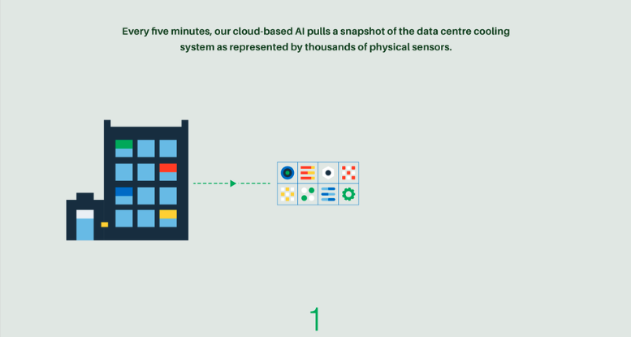
    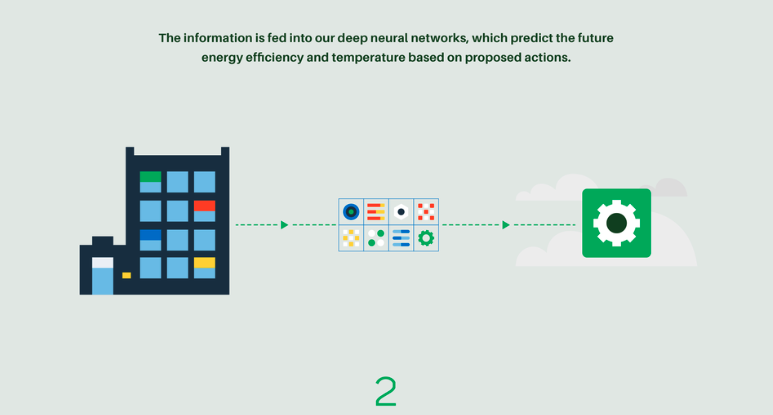
    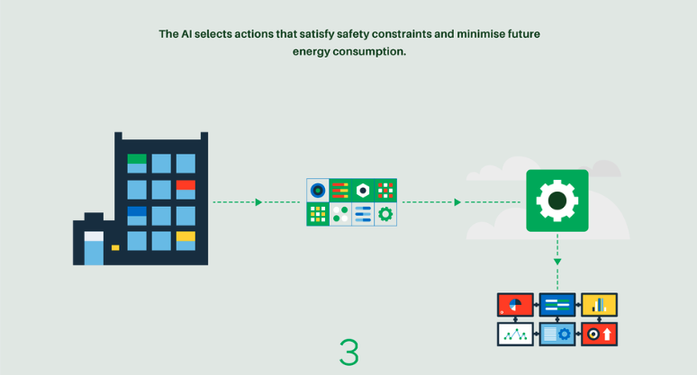
    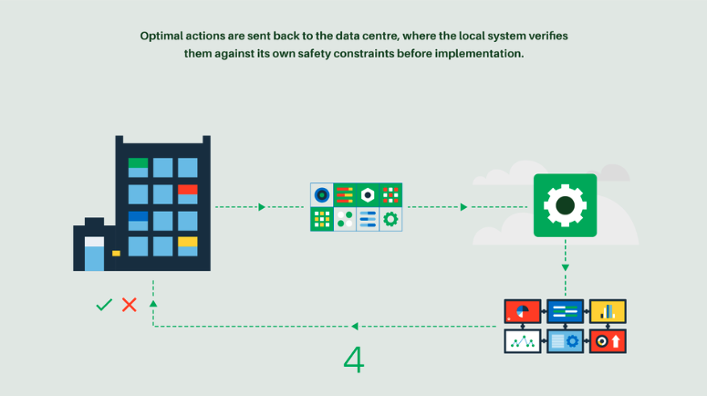
    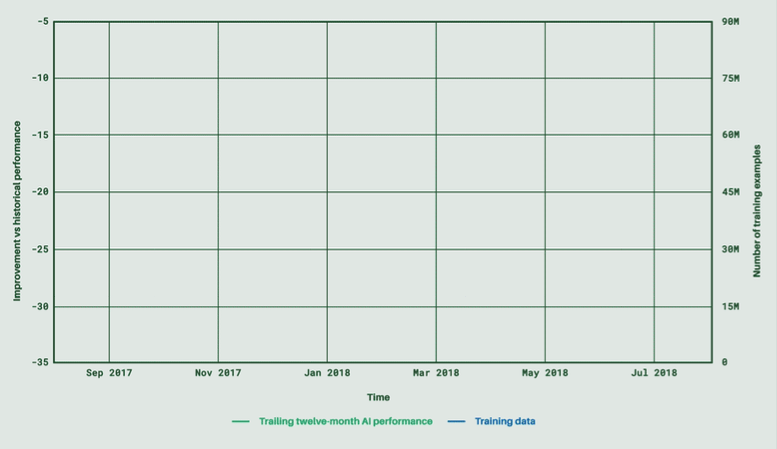
     
    <em>Source: [deepmind.google/discover/blog/safety-first-ai-for-autonomous-data-centre-cooling-and-industrial-control/](https://deepmind.google/discover/blog/safety-first-ai-for-autonomous-data-centre-cooling-and-industrial-control/)</em>

<h3>💨 Wind Turbines: Boosting the Value of Wind Energy</h3>

    

Reinforcement learning is also used to optimize the orientation of wind turbines, ensuring they adjust dynamically to maximize energy production. By continuously learning from wind patterns and environmental conditions, RL algorithms enhance forecastic accuracy, improving both efficiency and sustainability.

    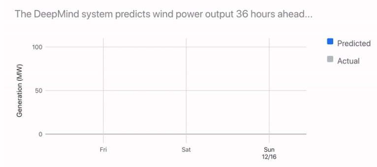
     
    <em>Source: [deepmind.com/blog/article/machine-learning-can-boost-value-wind-energy](https://deepmind.com/blog/article/machine-learning-can-boost-value-wind-energy)</em>

<h3>🔋 Android: Enhancing Battery Life and Display Performance</h3>

    

Modern smartphones rely on AI to optimize user experience, and reinforcement learning plays a key role in making Android devices smarter and more efficient. By continuously adapting to user behavior, reinforcement learning helps improving power management and display settings, leading to better performance and energy savings:

- **Adaptive battery**: used to learn and anticipate future battery use.

- **Adaptive brightness of the video**: algorithm learns preferences in terms of brightness from the user.

These AI-driven optimizations enhance battery life and display performance, providing a seamless and energy-efficient user experience.

## Reinforcement Learning for Generative AI

Reinforcement learning is at the core of many groundbreaking AI advancements, driving a multi-trillion-dollar revolution. Actually, besides robotics and game-playing AI, reinforcement learning plays a key role in training large language models (LLMs).

Therefore, we're entering this **Brave New Wold**[^4] of agents that are based on foundational models and this is really changing everything (referring to the launch of Chat-GPT in 2022). ***Sparks of Artificial General Intelligence*** (i.e. general purpose AI) refers to the early signs that artificial intelligence is reaching human-like capabilities (or even more), such as general reasoning, autonomous learning (making decisions), and adaptability to different tasks.

This expression became popular after the Microsoft Research paper titled "Sparks of Artificial General Intelligence: Early experiments with GPT-4", in which researchers suggested that GPT-4 exhibits some characteristics that could be considered precursors to AGI (Artificial General Intelligence). However, the model is not yet a true AGI but rather a step in that direction.

[^4]: *"Brave New World":* term taken from Aldous Huxley's novel to indicate something completely new.

<iframe src="papers/1__4__Sparks_of_Artificial_General_Intelligence_Early_experiments_with_GPT-4.pdf" width="100%" height="400px"></iframe>

<em>The Brave New World</em>

    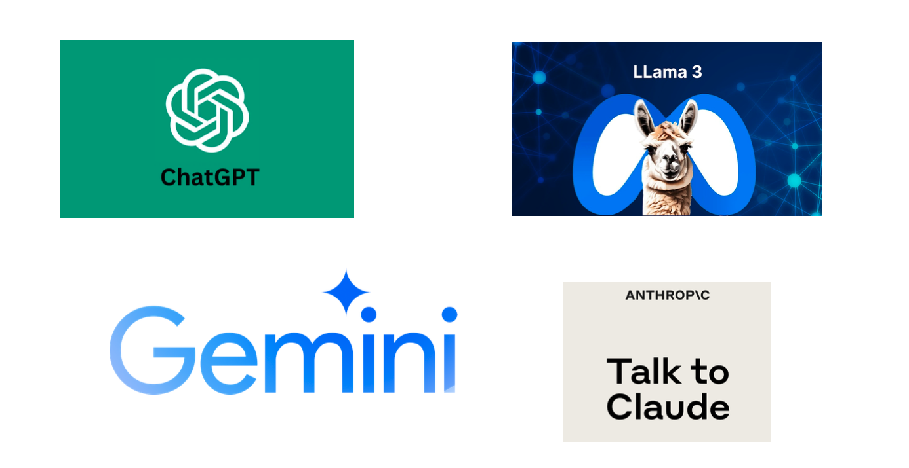

These foundational LLMs are trained using reinforcement learning in various ways.
One key approach is **Reinforcement Learning from Human Feedback (RLHF)**:

    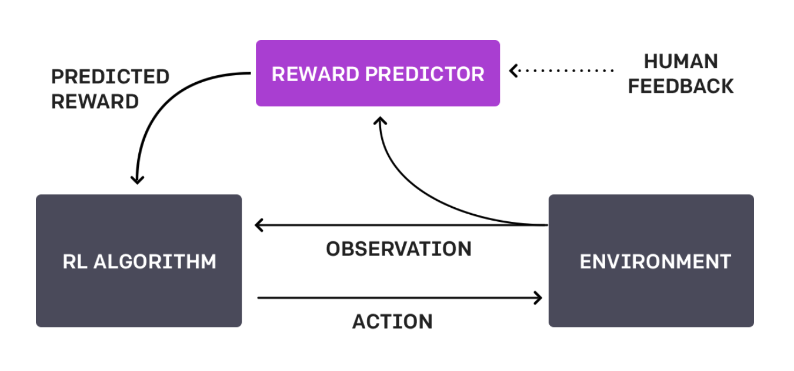

It involves **human preferences**, where either humans or machine-generated feedback (known as *distillation*, such as DeepSeek using GPT-4) helps optimize outputs. A common method for this is **Direct Preference Optimization (DPO)**, which fine-tunes models based on ranked feedback.

<iframe src="papers/1__5__Deep_Reinforcement_Learning_from_Human_Preferences.pdf" width="100%" height="400px"></iframe>

Even more effectively, instead of relying on direct human feedback for every interaction, we can build a **model of preferences** —trained on responses from a large number of people— to encapsulate human preferences and guide model training more efficiently.

<h3>State of the Art</h3>

<iframe src="papers/1__6__Reinforcement_Learning_for_Generative_AI_State_of_the_Art_Opportunities_and_Open_Research_Challenges.pdf" width="100%" height="400px"></iframe>

<iframe src="papers/1__7__Generative_Agents_Interactive_Simulacra_of_Human_Behavior.pdf" width="100%" height="400px"></iframe>

<em>"Generative" Agents</em>

"Generative Agents: Interactive Simulacra of Human Behavior" is a research paper that explores the simulation of a virtual city populated by AI-driven agents. These agents, implemented using language models, interact with each other in a dynamic environment, engaging in everyday activities such as having coffee, conversing, and forming relationships. The study aims to create realistic social behaviors and emergent narratives through AI-driven interactions.

    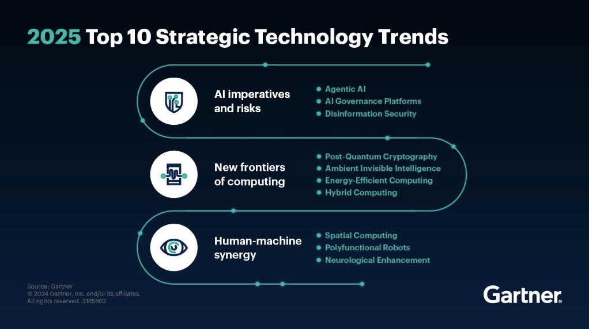
    <em>Agentic AI ranks first among the Top 10 Stretegic Technology Trends.</em>

The technologies we’re discussing today are crucial not only for innovation but also for democracy, as they help combat disinformation, and for national security. Moreover, they play a growing role in decision-making, as they are increasingly influencing areas such as economic policy, governance, taxation, cybersecurity, and more. As such, we bear a responsibility to our country in how we harness and guide these technologies.

    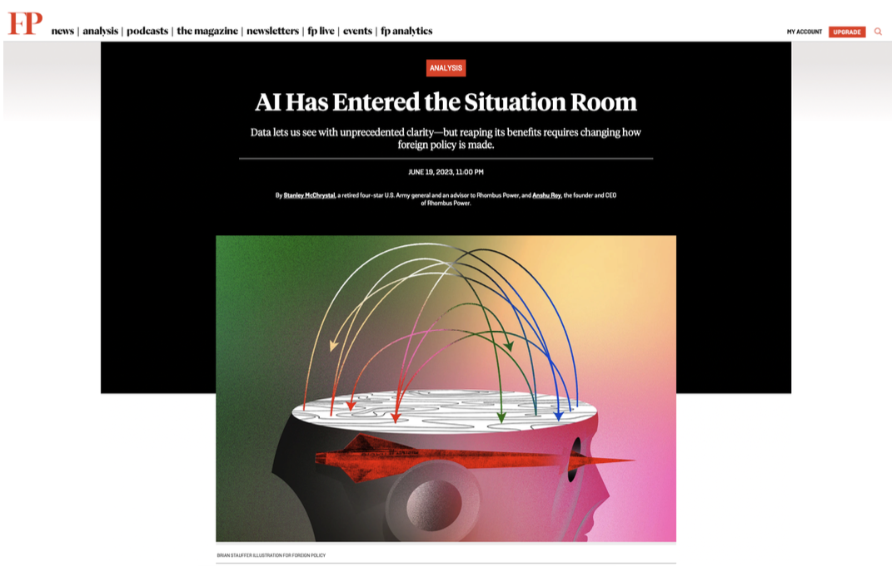
    <em>Source: [foreignpolicy.com/2023/06/19/ai-artificial-intelligence-national-security-foreign-policy-threats-prediction/](https://foreignpolicy.com/2023/06/19/ai-artificial-intelligence-national-security-foreign-policy-threats-prediction/)</em>

The article "AI Has Entered the **Situation Room**[^5]" from Foreign Policy discusses the transformative impact of artificial intelligence (AI) on national security and foreign policy decision-making. It highlights how AI enables unprecedented data analysis capabilities, allowing policymakers to gain clearer insights into complex global situations. The authors argue that to fully harness AI's potential, traditional approaches to foreign policy formulation must evolve to integrate these advanced technological tools effectively. ​

[^5]: *"Situation Room":* a secure space or command center where leaders and key officials convene to make urgent decisions, often related to national security, crises, or military operations. These decisions may include diplomatic, strategic, and security-related matters.

## Intelligent, Adaptive and Autonomous Agents

<h3>Definitions</h3>

> An ***INTELLIGENT AGENT*** is an entity that perceives its environment and takes actions that maximise the probability of achieving its goals.

- Agents might be physically situated (we call them robots) or not (we refer to them as *software agents* -or just *agents*-, *softbots*, *bots*, etc.).
An emerging terminology, such as *embodied AI* and *embodied AI agents* refers to agents that interact with and act within a specific environment. 

> An ***ADAPTIVE AGENT*** is an entity that is capable of responding (by adapting) to its environment.

- <u>The environment might also include other agents</u>, encompassing their locations, actions, interactions (e.g., how they respond to the agent), and all relevant information about them. 

- The environment is everything else outside the agent.

> An ***AUTONOMOUS AGENT*** is an entity that relies only on its perception (what it can *sense* and get from the environment) and acts in the world independently from its designer.

- It takes decisions and acts independently from the way the agent itself is designed.

- <u>An autonomous agent should be able to compensate for partial knowledge</u>: if the agent doesn't know something about the world, it will try to get knowledge about it. This involves searching, exploring, experimenting, and interacting in order to understand how the world works.

- Classical multi-agent systems are based on logic, and in Prolog terms, facts are what define the entire understanding of the world.

- Here we're talking about agents that proactively try to discover knowledge and information about the world.

<h3>Learning and Autonomous Agents</h3>

From a practical point of view, it makes sense to provide the agent with **some knowledge of the world** and the <u>**ability to learn**</u>:

As in the case of evolution, in which animals/humans have a sufficient number of built-in reflexes in order to survive long enough to learn by themselves, it is reasonable to provide an artificial intelligent agent with some initial knowledge as well as an ability to learn and adapt.

After gaining sufficient experience of its environment, an intelligent agent can become effectively **independent from its prior knowledge**. The idea is that, while the agent starts with some initial understanding of the world, it gradually adapts and learns to act beyond its original knowledge. However, it does not discard it prior knowledge: ***forgetting***  is a big issue in Reinforcement Learning. Instead, the agent integrates new experiences while retaining and building upon its initial foundation.

For this reason, learning allows an intelligent agent to survive in a vast variety of environments: they're **adaptive**.

<h3>Designing Agents</h3>

Dimensions that should be taken into consideration in designing agents are the following:

- Performance — *how accurate they are in completing a certain task*.
- Environment — *where they are going to be deployed*.
- Actuators — *what they can do = what are the actions they can perform* (physical or software).
- Sensors — *how they can sense and gather information from the environment*.

    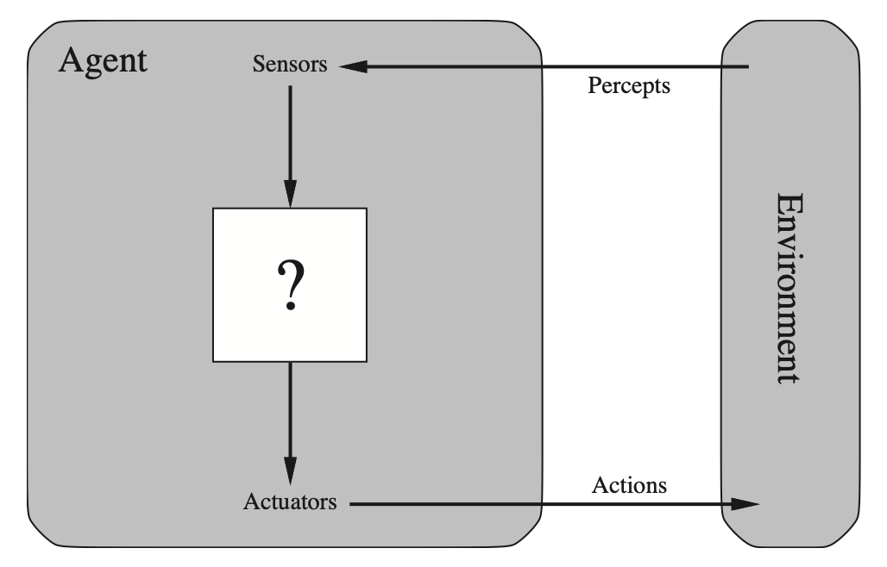

    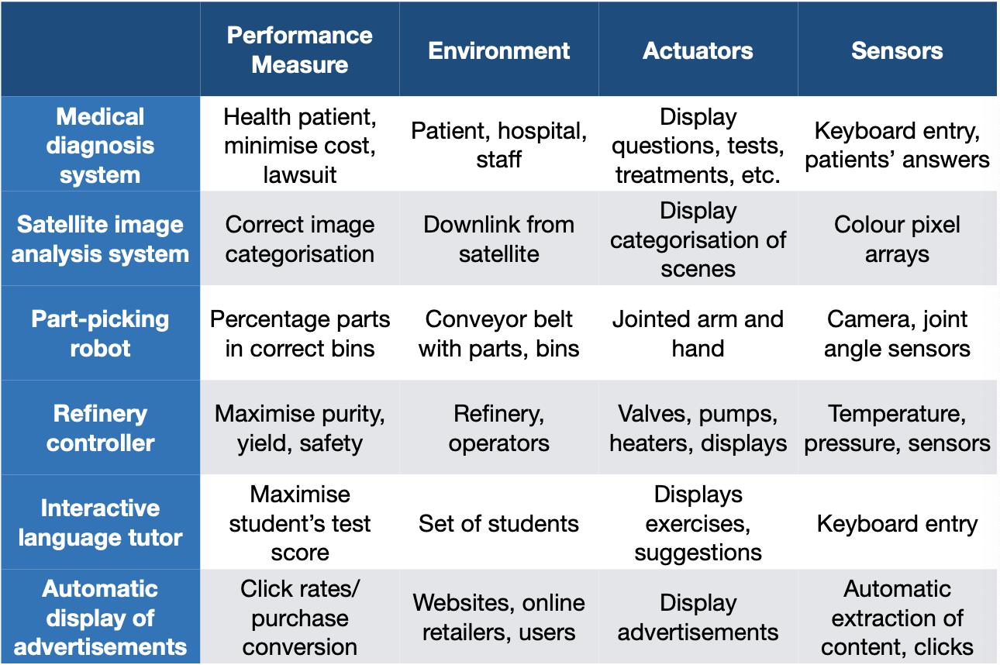

<h4>Automatic display of advertisement example:</h4>

Meta's system is designed to deliver the most relevant ads to users. It functions as an autonomous agent that decides which advertisements to display based on user interactions, such as time spent on videos, likes, and clicks on various posts. The agent is independent and continuously learns from user interactions to refine its ad recommendations. In particular:

- **Performance**: The accuracy and effectiveness of ad targeting, measured by engagement rates, click-through rates (CTR), and conversion rates.
- **Environment**: The digital ecosystem, including Meta's platforms (Facebook, Instagram, etc.), where user interactions take place.
- **Actuators (actions)**: Displays a specific ad from a certain relevant category.
- **Sensors**: Tracks user behavior, including time spent on content, engagement metrics (likes, shares, comments), and click-through rates. Additionally, it explores user preferences by occasionally displaying random ads to gather new data.

<h3>Characteristics of the Environments</h3>

We have different dimensions:

- **Fully observable** vs **Partially observable**:

    - *Fully observable:* The agent is able to know everything about the environment at any given time. Example: chess, where the entire board state is visible.

    - *Partially observable:* The agent only has access to limited or incomplete information about the environment, requiring it to infer missing details. Example: poker, where opponents' cards are hidden.

- **Deterministic** vs **Stochastic**:

    - *Deterministic:* The next state of the environment is completely determined by the current state and the agent's actions, so it is predictable what is going to happen in the future. Example: chess, where every move has a predictable outcome.

    - *Stochastic:* There is an element of randomness in the environment, meaning that the same action can lead to different outcomes, so it is unpredictable what's going to happen because we don't know how the world will evolve. Example: rolling a dice in a board game.

- **Episodic** vs **Sequential**:

    - *Episodic:* The agent interacts only once with the environment, for an episode. Example: image classification, where each image is classified separately.

    - *Sequential:* The agent have multiple interactions with the environment, multiple episodes that are repeated. Example: playing a video game, where past actions influence future gameplay.

- **Static** vs **Dynamic**:

    - *Static:* The environment does not change unless the agent interacts with it. Example: a turn-based board game.

    - *Dynamic:* The environment evolves over time, even if the agent does nothing. Example: a self-driving car system, where traffic and pedestrians move independently.

- **Discrete** vs **Continuous**:

    - *Discrete:* The state space and actions are limited to a finite set of possibilities. Example: tic-tac-toe, where moves are predefined.

    - *Continuous:* States and actions are infinite or highly granular, requiring complex decision-making. It is always possible to discretize a continuous environment. Example: controlling a robotic arm with infinitely variable movements.

- **Single agent** vs **Multi-agent**:

    - *Single agent:* The environment contains only one agent, with no other autonomous entities. Example: a maze-solving robot.

    - *Multi-agent:* Multiple agents interact, either cooperatively or competitively. Example: online multiplayer games or stock market trading algorithms.

<h3>A Categorization of Intelligent Agents</h3>

There are essentially four basic kinds of agent programs:

1. Simple reflex agents;

1. Model-based agents;

1. Goal-based agents;

1. Utility-based agents.

The behaviour of these agents can be ***hard-wired*** or it can be acquired, improved and optimised through ***learning*** (see section [Learning](#learning)).

<h4>Simple Reflex Agents:</h4>

> ***Simple reflex agents*** select actions on the basis of the current perception —like humans *reflexes* when they perceive pain— ignoring the rest of the perception history.

- These are the most basic form of agents, they are based on ***condition-action rules*** (also called simulation-action rules, productions or if-then rules).

- Humans also have a set of automatic (learned) responses in their biology.

- They are suitable for situations where the decisions can be made on the ***current observation***.

    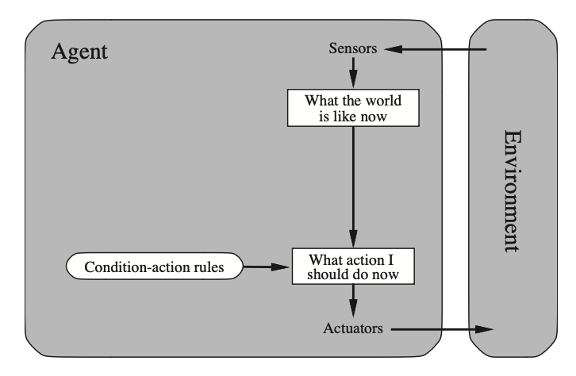

<h4>Model-based Agents:</h4>

> A ***Model-based agent*** is an agent that keeps an internal state —to keep information of past acquired knowledge— and depends on two types of knowledge:
>
> 1. how the world evolves independently from the agent.
> 1. how the actions of the agent affects the world.

- An ***internal state*** (kept inside the agent) is essentially used to keep track of what is not possible to see right now. It depends on the perception history and, for this reason, it reflects at least some of the unobserved aspects of the current state.

- Examples of internal states are:
    - Human's brain has an internal state which is continuously updated: the structure of the synapses is continuously modelled in order to form new memories. This internal state is crucial to keep learning.
    - A fine-tuned language model undergoes weight updates, altering its internal state. These weight adjustments shape the model’s learning and adaptation over time.

- This internal state is different from the state of the environment, i.e. what we use in order to make a decision.

- Usually the model-based agent can also include condition-action rules.

    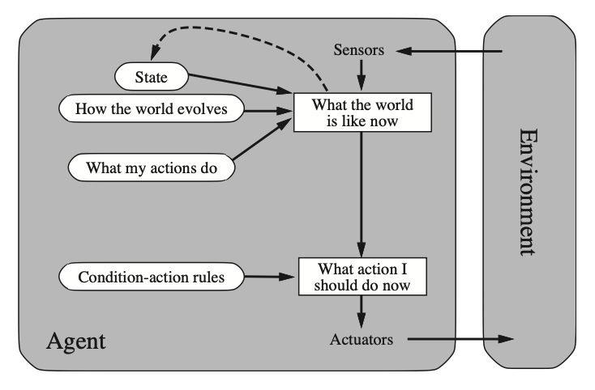

<h4>Goal-based Agents:</h4>

> ***Goal-based agents*** act to achieve their goals —the action is conditioned to the goal to be achieved.

- Sometimes goal-based satisfaction is straightforward, when goal satisfaction results immediately from a single action.

- In other cases, an agent has to consider a long sequence of actions to achieve their goal through ***search*** and ***planning***. E.g. The A* algorithm finds the solution to some problems (it does not solve Go) through a set of steps, but it doesn't scale a lot.

- However, some problem are not solvable with planning. ***Subgoals*** are set to decide what to do next in order to achieve the final goal (it is not planning).

    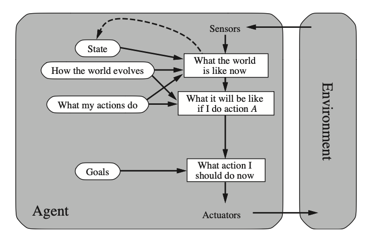

<h4>Utility-based Agents:</h4>

> ***Utility-based agents*** are agents whose goals are expressed through a utility function.

- Goals are not really sufficient to generate "high-quality behaviour" in most environments —the are solutions to reach the goal that are better than others.

- We model states preferred to others using ***utilities*** (or **payoffs** or, for reinforcement learning engineers, **rewards**).

- These agents aim to maximize their utility.

- Utility functions maps a state (or a sequence of states) onto a real number, which describes the preferences of an agent.

- Examples:
    - Taxi routing to destination (quicker route, the shortest path is preferable).
    - Google ads displaying (click on the ad for which the payment for the ad fee is the highest).

- There are situations in which the agents have competitive objectives.
    - For example, a taxi driver, who is paid based on distance traveled, may have an incentive to take longer routes, while the client's utility is to reach the destination as efficiently and affordably as possible.

    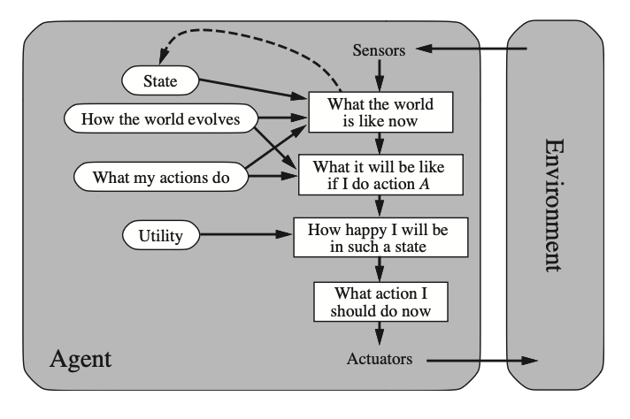

## What's next

### Learning {.unnumbered #learning}

The behaviour of the agents can be pre-programmed and fixed or it can be *learned*.

- In order to allow for learning agents need a ***learning component*** (goal-based or utility-based through experience).

- The learning component can be based on a model of the world and the gain towards a certain goal (possibly expressed in terms of change of the value of utility functions) can be expressed through ***rewards***.

In this module we will explore in depth a type of learning called **Reinforcement Learning** based on rewards following a certain action.

<h3>Autonomous and Adaptive Systems</h3>

In this module, we will adopt a very broad view of intelligent, adaptive and autonomous agents.

Following **Herbert Simon**[^6] ’s famous definition, we will consider more broadly:

> “machines that <u>think</u>, that <u>learn</u>, and that <u>create</u>”.

Herbert Simon, a two-time Nobel laureate, was an economist who made significant contributions to machine learning and decision theory in complex systems. He is considered a foundational figure in modern artificial intelligence and agent-based systems, as he pioneered the concept of simulating economic behavior —essentially modeling society through computational methods.

Of course ***"thinking"*** is an ill-defined concept (*"Do the LLMs reason?"* ), which we will try to discuss during the module in detail.

We will take a ***system-view***, i.e., we will consider the design of intelligent and autonomous agents considering the algorithmic and implementation issues and the interactions between the different entities at various levels of abstraction.

[^6]: *Herbert Simon (1916 – 2001):* [https://it.wikipedia.org/wiki/Herbert_Simon](https://it.wikipedia.org/wiki/Herbert_Simon)

<h3>Building Intelligent Machines</h3>

An underlying theme of the module will be the definition of intelligence.

Recalling our definition of intelligent agents:

> An ***intelligent agent*** is an entity that perceives its environment and takes actions that maximise <u>the probability of achieving its goals.</u>

Indeed, since the world is complex, messy, and noisy, our understanding of it —built through incremental learning with such systems— is inherently probabilistic. As a result, we will focus extensively on **probabilistic systems**.

Our goal at the end will be to build intelligent machines, but we will also compare machine intelligence with human and animal intelligence.

This is a fascinating aspect of the study of these systems: <u>they help us in understanding what intelligence means in abstract and what makes
us humans.</u>

<h3>Artificial General Intelligence</h3>

In the recent years we had several successes in building more and more sophisticated systems.

> ***Human-level Artificial Intelligence*** or ***Artificial General Intelligence*** is the intelligence of an entity (agent, machine, etc.), which has the capacity of learning any task <u>at or above human-level</u> (at least as an human being).

We will discuss the current state-of-the-art in this area and we will also outline the challenges and opportunities ahead.

## References

Some of the definitions and some of the figures of this section are from:

- **Chapter 2** of @russell2020

## Suggested Readings

- @simon1996