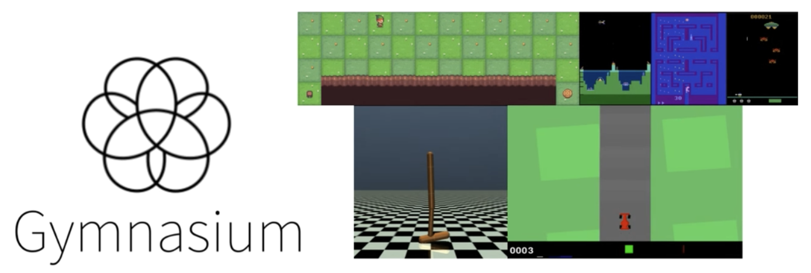
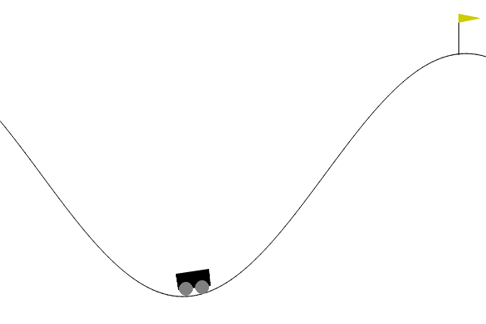
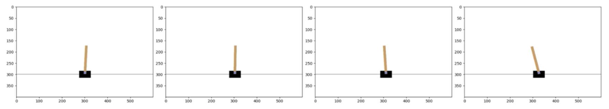

<h1>Gymnasium</h1>

- Standard library for RL tasks

- Abstracts complexity of RL problems

- Provides a plethora of RL environments: from classic control tasks to more complex environments like [Atari games](https://ale.farama.org/environments/).

<p align="center">
    
</p>


## Key Gymnasium environments

Some key environment examples are:

<h3>CartPole</h3>

<p align="center">
    
</p>

- Agent must balance a pole on a moving cart and prevent it from falling

- [https://gymnasium.farama.org/environments/classic_control/cart_pole/](https://gymnasium.farama.org/environments/classic_control/cart_pole/)

<h3>MountainCar</h3>

<p align="center">
    
</p>

- Agent must drive a car up a steep hill

- [https://gymnasium.farama.org/environments/classic_control/mountain_car/](https://gymnasium.farama.org/environments/classic_control/mountain_car/)

<h3>FrozenLake</h3>

<p align="center">
    
</p>

- Agent must navigate a frozen lake with holes, finding a safe path across it

- [https://gymnasium.farama.org/environments/toy_text/frozen_lake/](https://gymnasium.farama.org/environments/toy_text/frozen_lake/)

<h3>Taxi</h3>

<p align="center">
    
</p>

- Picking up and dropping off passengers, focusing of efficient tour planning and task management

- [https://gymnasium.farama.org/environments/toy_text/taxi/](https://gymnasium.farama.org/environments/toy_text/taxi/)


## Gymnasium interface

No matter the environemnt, the Gymnasium library offers an unified interface for interaction. This interface includes functions and methods to:

- Initialize environment
- Visually represent environment
- Execute actions
- Observe outcomes

Let's explore them using the CartPole environment.

<h3>Interacting with Gymnasium environments</h3>

In the following snippet we:

1. Create the environment, by calling the `gym.make` function and passing the id of the environment *CartPole* along with `render_mode` equals `rgb_array` allowing us to visualize the states using matplotlib. Other render modes exist.
1. Initialize the environment and return the initial observation along with some auxiliary information, by calling the method `env.reset`. The `seed` argument can be used to ensure reproducibility.
1. Print the intial observation.

```{python}
import gymnasium as gym

env = gym.make('CartPole', render_mode='rgb_array')
state, info = env.reset(seed=42)
print(state)
```

The observation as an array represents the environment state, including the position and velocity of both ther cart and the pole.

For other environments, we'll need to consult the [Gymnasium Documentation](https://gymnasium.farama.org) to understand the details of their states.

<h3>Visualizing the state</h3>

To get a visual representation of the state, the `env.render` method returns the state image that we can visualize using the `plt.imshow` function. Then, by calling `plt.show`, a snapshot of the environment will be displayed.

```{python}
import matplotlib.pyplot as plt

def render():
    state_image = env.render()
    plt.imshow(state_image)
    plt.show

render()
```

<h3>Performing actions</h3>

In the CartPole environment there are two possible actions:

- $0:$ moving the cart to the left
- $1:$ moving the cart to the right

To execute an action we call `env.step` and pass the chosen action. This method return five values:

1. The next **state**
1. The **reward** received
1. A **terminated** signal, indicating wether the agent has reached a terminal state such as achieving the goal or loosing
1. A **truncated** signal, showing wether a condition like a time limit has been met
1. **Info** which provides auxiliary diagnostic information useful for debugging 

We omit *truncated* and *info* in our script for simplicity and we print the first three return values after moving the cart to the right.

```{python}
action = 1
state, reward, terminated, truncated, info = env.step(action)

print("State: ", state)
print("Reward: ", reward)
print("Terminated: ", terminated)
```

We see the state changed and the agent received a reward of $1$, since it hasn't reached a terminal state yet.

<h3>Interaction loops</h3>

Suppose we want to keep pushing the cart to the right until a termination condition is met and monitor the environment.
We add the previous code in a while loop and render the environment at each iteration.

```{python}
#| eval: false
while not terminated:
    action = 1  # Move to the right
    state, reward, terminated, _, _ = env.step(action)
    render()
```

<p align="center">
    
</p>

Here are some chosen plots showing the cart movements to the right.


## References

- DataCamp, [Reinforcement Learning with Gymnasium in Python](https://app.datacamp.com/learn/courses/reinforcement-learning-with-gymnasium-in-python)