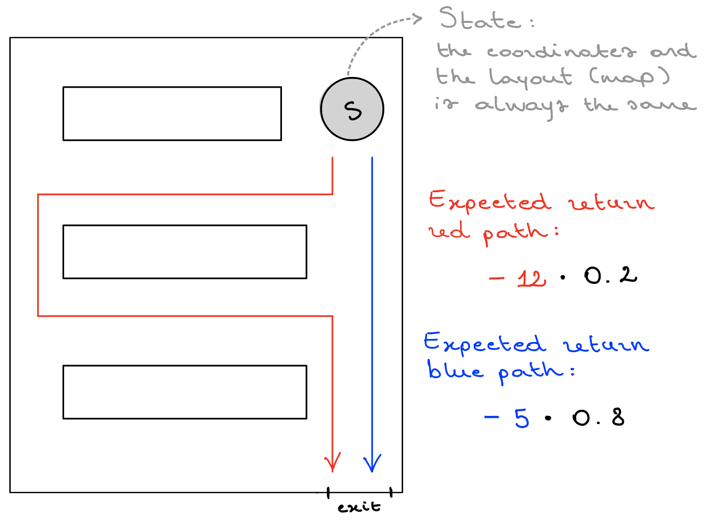
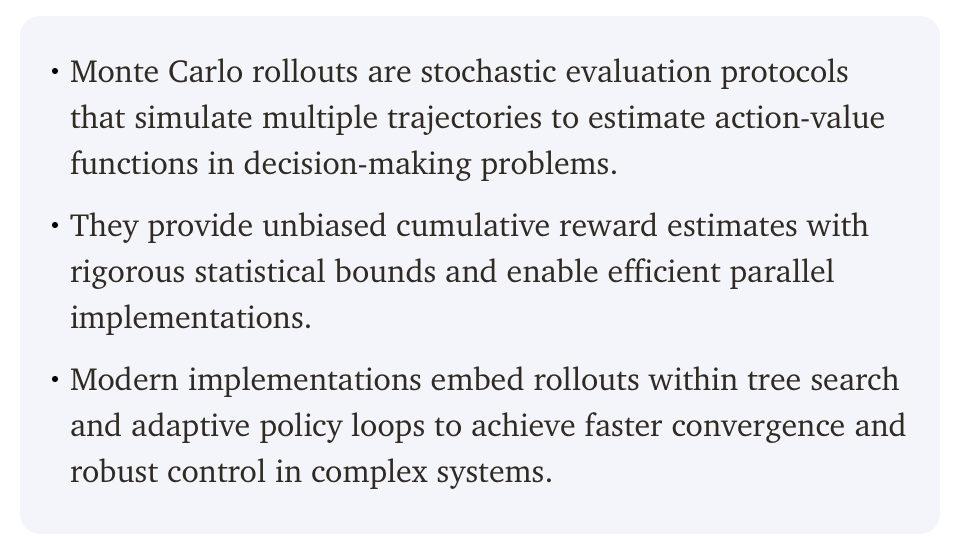
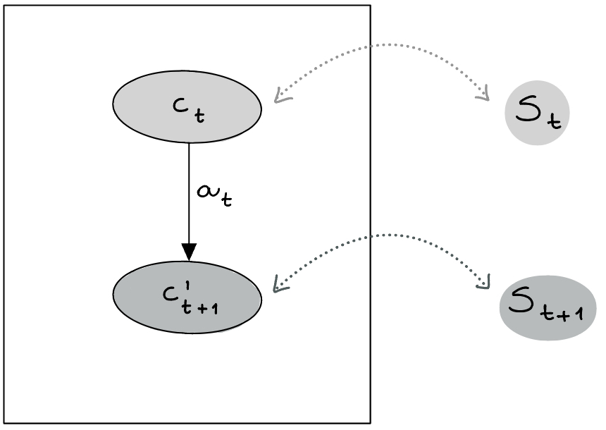

- Key idea: a natural way of thinking about learning is learning through **interaction** with the external world.

    - <u>Learning from interation</u> is a foundational idea underlying nearly all theories of learning and intelligence.

- Reinforcement learning is <u>learning while acting</u> what to do —how to map situations to ***actions***— so as to maximise a numerical ***reward***.

- Differently from supervised learning (see section [Difference between RL and other ML sub-domains](#difference)), reinforcement learning is about <u>how to act and how to explore</u> in order to achieve the **goal**:

    - **Goal-directed** learning from interaction.

    - The learner is not told which actions to take, but instead it must discover which actions yield the most reward by trying them through exploration.

- We want to learn how <u>to map a certain state</u> —what we know about the world, which we use in order to make a decision— <u>to a probability of taking a certain action</u>. This mapping is called a **policy**: we have to learn the policy (see section [Policy](#policy)).

    - A ***state*** can be anything. For example the pixels of Atari, what is displayed on a web page, etc.

    - The **probability** is expressed in terms of <u>maximization of the rewards</u>.


## RL Problem Formulation

The objective of reinforcement learning is to maximise the **cumulative reward** —the sum of the individual rewards obtained at each decision point for each action.

We need to design the RL system in order to map this general framework into the problem that we're trying to solve, so we must define:

1. *States*

1. *Actions*

1. *Rewards*


<h3>Examples of Problems</h3>

<p align="center">
    
    
</p>

1. **Go:**

    - *State:*  configuration of the board, represented as a finite matrix of 3 possible values (black, white, empty), which can be flattened into a fixed-length vector and used as input to a neural network.
    - *Actions:*  where to place the pieces.

2. **Roomba:**

    - *State:*  position of the agent, in a partially observable environment.
    - *Actions:*  where to go.


## Finite Markov Decision Processes

**Markov Decision Processes** (**MDPs**) are a mathematically idealised formulation of Reinforcement Learning for which precise theoretical statements can be made.

- Tension between breadth of applicability and mathematical tractability.

- MDPs provide a way for framing the problem of learning from experience, and, more specifically, from interacting with an environment.

<h3>Definitions</h3>

Reinforcement Learning, or RL for short, is a unique facet of machine learning where <u>an agent learns to make decisions through trial and error</u>.

Two main entities:

<p align="center">
    
</p>

1. **Agent** = learner and decision-maker.

    - Interacts with the environment selecting ***actions***.
    - ***Observes*** and acts within the environment.
    - Receives:
        - ***rewards*** for good decisions (aka *positive rewards*).
        - ***penalties*** for bad decisions (aka *negative rewards*).

1. **Environment** = everything else outside the agent.

    - Changes following actions of the agent.

- **Goal**: devise a strategy that <u>maximises the total reward over time</u> .

<h3>RL framework</h3>

- **Agent**: learner, decision-maker.
- **Environment**: challenges to be solved.
- **State**: environment snapshot at given time.
- **Action**: agent's choice in response to state.
- **Reward**: feedback for agent action (positive or negative scalar).

<p align="center">
    
</p>

<h3>RL interaction loop</h3>

- The agent and the environment interact at each discrete step of a sequence $t=0,1,2,3,\dots$

- At each time step $t$, the agent receives some representation of the environment **state** $S_t \in \mathcal{S}$, where $\mathcal{S}$ is the set of the states.

- On that basis, an agent selects an **action** $A_t \in \mathcal{A}(S_t)$, where $\mathcal{A}(S_t)$ is the set of the actions that can be taken in state $S_t$.

- At time $t+1$, as a consequence of its action, the agent receives a **reward** $R_{t+1} \in \mathcal{R}$, where $\mathcal{R}$ is the set of rewards (expressed as real numbers).

<p align="center">
    
</p>

Let's demonstrate the agent-environment interaction using a generic code example. The process starts by creating an environment and retrieving the initial state. The agent then enters a loop where it selects an action based on the current state in each iteration. After executing the action, the environment provides feedback in the form of a new state and a reward. Finally, the agent updates its knowledge based on the state, action, and reward it received.

```{python}
#| eval: false
env = create_environment()
state = env_get_initial_state()

for i in range(n_iterations):
    action = choose_action(state)
    state, reward = env_execute(action)
    update_knowledge(state, action, reward)
```


## Goals, Rewards and Returns

<h3>Goals and Rewards</h3>

- The **goal** of the agent is formalised in terms of the reward it receives.

- At each time step, the reward is a simple number $R_t \in \mathbb{R}$ (scalar, real number).

- Informally, the agent's goal is to maximise the **total amount** it receives. The goal is mapped into the ***maximisation of the reward***.

- <u>The agent should not maximise the immediate reward, but the **cumulative reward**.</u>

<h3>The Reward Hypothesis</h3>

We can formalise the goal of an agent by stating the "reward hypothesis":

> *All of what we mean by goals and purposes can be well thought of as the maximisation of the **expected value**[^1] of the cumulative sum of a received scalar signal (reward).*

[^1]: The *expected value* (also called the *mean* or *mathematical expectation*) of a random variable is a measure of the center of its probability distribution —essentially, it's the average outcome we'd expect if we repeated an experiment many times.

<h3>Expected Returns</h3>

We will now try to conceptualize the idea of **cumulative reward** more formally.

In RL, actions carry long-term consequences, impacting both immediate and future rewards. The agent's goal goes beyond maximizing immediate gains; it receives a sequence of rewards and it strives to accumulate the highest *total reward over time*. This leads us to a key concept in RL: the **expected return**.

> The ***expected return*** $G_t$ is a function of the reward sequence $R_{t+1}, R_{t+2}, R_{t+3}, \dots$
>
>> $G_t$ is the sum of all rewards the agent expects to accumulate throughout its journey.

<p align="center">
    
</p>

Accordingly, the agent learns to anticipate the sequence of actions that will yield the highest possible return.

<h3>Episodic Tasks and Continuing Tasks</h3>

In RL, we encounter two types of tasks: *episodic* and *continuous*.

Episodic tasks are those in which we can identify a final step of the sequence of rewards, i.e. in which the interaction between the agent and the environment can be broken into sub-sequences that we call ***episodes*** (such as play of a game, repeated tasks, etc.). For example, in a chess game played by an agent, each game constitutes an episode; once a game concludes, the environment resets for the next one.

> An ***episodic task*** is divided into distinct episodes, each with a defined beginning and end.
>
>> Each *episode* ends in terminal state after $T$ steps, followed by a reset to a standard starting state or to a sample of a distribution of starting states.
> 
>> The *next episode* is completely independent from the previous one.

On the other hand, continuing tasks involve ***ongoing interaction*** without distinct episodes (e.g. ongoing process control or robots with a long-lifespan). A typical example is an agent continuously adjusting traffic lights in a city to optimize flow.

> A ***continuing task*** is one in which it is not possible to identify a final state.

<h3>Expected Return for Episodic Tasks and Continuing Tasks</h3>

> In the case of ***episodic tasks*** the ***expected return*** associated to the selection of an action $A_t$ is the sum of rewards defined as follows:
> 
>> $G_t \doteq R_{t+1} + R_{t+2} + R_{t+3} + \dots + R_T$

> In the case of ***continuing tasks*** the ***expected return*** associated to the selection of an action $A_t$ is defined as follows:
>
>> $G_t \doteq R_{t+1} + \gamma R_{t+2} + \gamma^2 R_{t+3} + \dots  = \sum_{k=0}^\infty \gamma^k R_{t+k+1}$
>
> where $\gamma$ is the **discount rate**, with $0 \leq \gamma \leq 1$.

<h3>Discounting Rewards</h3>

The definition of expected return that we used for episodic tasks would be problematic for continuing tasks: the expected return of time of termination $\mathbf{T}$ would be equal to $\infty$ in some cases, such as when the reward is equal to 1 at each time step.

Immediate rewards are typically valued more than future ones, leading to the concept of **discounted return**: to discout future rewards. This concept prioritizes more recent rewards by multiplying each reward by a **discount rate**, $\gamma$, raised to the power of its respective time step.

- The discount rate determines the ***present value of future rewards**:* a reward received $k$ time steps in the future is worth $\gamma^{k-1}$ what it would be worth if it were received immediately.

- For example, for expected rewards $r_1$ through $r_n$, the discounted return would be calculated as:

<p align="center">
    
</p>

The discount factor $\gamma$, ranging between 0 and 1, is crucial for balancing immediate and long-term rewards.

- It is an **hyperparameter**[^2] we need to study. In practice, it is an intrinsic parameter of the mathematical model itself that needs to be set beforehand to ensure optimal learning performance or faster convergence during training. When training a neural network, we perform a ***parameter search***[^3], exploring the space of possible values—often by evaluating different combinations of hyperparameters. This search process is typically very computationally expensive, so it’s important to carry it out as efficiently as possible.

- A lower $\gamma$ value leads the agent to prioritize immediate gains, while a higher value emphasizes long-term benefits.

- At the extremes, a $\gamma$ of $0$ means the agent focuses solely on immediate rewards, while a $\gamma$ of $1$$ considers future rewards as equally important, applying no discount.

[^2]: A *hyperparameter* is a parameter not learned by the model, but that guides the learning process (e.g. the number of layers, the number of nodes, the activation function of the network, etc.).

[^3]: *Scikit-learn* has a [tool for doing parameter search](https://scikit-learn.org/stable/modules/grid_search.html).

<p align="center">
    
</p>

<h4>Numerical example:</h4>

In this example, we'll demonstrate how to calculate the discounted return from an array of `expected_rewards`. We define a `discount_factor` of 0.9, then create an array of discounts, where each element corresponds to the discount factor raised to the power of the reward's position in the sequence.

```{python}
import numpy as np
expected_rewards = np.array([1, 6, 3])
discount_factor = 0.9
discounts = np.array([discount_factor ** i for i in range(len(expected_rewards))])
print(f"Discounts: {discounts}")
```

As we can see, discounts decrease over time, giving less importance to future rewards. Next, we multiply each reward by its corresponding discount and sum the results to compute the `discounted_return`, which is 8.83 in this example.

```{python}
discounted_return = np.sum(expected_rewards * discounts)
print(f"The discounted return is {discounted_return}")
```

<h3>Relation between Returns at Successive Time Steps</h3>

> Returns at successive time steps are related to each others as follows:
>
>> $G_t \doteq R_{t+1} + \gamma R_{t+2} + \gamma^2 R_{t+3} + \gamma^3 R_{t+4} + \dots$<br>
>> $\quad\;\; = R_{t+1} + \gamma (R_{t+2} + \gamma R_{t+3} + \gamma^2 R_{t+4} + \dots )$<br>
>> $\quad\;\; = R_{t+1} + \gamma G_{t+1}$


## Policies and Value Functions

Reinforcement learning is about actions and experience: learning how to act from experience.

For learning that, almost all reinforcement learning algorithms involve estimating ***value functions***, i.e., functions of states (or of state-action pairs) that estimate how good it is for the agent to be in a given state (or how good it is to perform a given action in a given state).

Evaluating the *value of a state* (i.e. the expected return from that state onwards) is fundamental because, since the goal is to maximise the total reward, we want to enter states giving us the highest cumulative reward.

A ***policy*** is used to model the behaviour of the agent based on the previous experience and the rewards (and consequently the expected returns) an agent received in the past.

We are learning <u>how to choose the states</u> (*state-value functions*) and <u>how to act</u>, i.e., with which probability we take a specific action (*policy*).

### Policy {.unnumbered #policy}

In Reinforcement Leraning, we have to learn the probability of taking a certain action, ***we have to learn the policy**:* given a state, which is the best action we can take[^4].

[^4]: *Policy* = the probability of taking a certain action in a certain state.

Formally, a *policy* is a mapping from states to probabilities of each possible action, i.e. policy $\pi$ is a *probability distribution*.

> If the agent is following ***policy*** $\mathbf\pi$ at time $t$, then
>
>> $\pi(a \vert s)$ is the probability that $A_t = a$ if $S_t = s$

Following the policy $\pi$ means taking the decision from that state onwards following that probability distribution: we're not acting deterministically in the same way all the time, but we're acting probabilistically.

<h4>Example:</h4>
- **Reward structure:** the reward at each step is −1, so the agent is incentivized to reach the goal in as few steps as possible.
- **Expected return:** if, from a given state, the agent moves in one direction with probability 20% and in the other direction with probability 80%, then the expected return from that state is the probability-weighted average of the returns obtained by taking each direction. That is, it equals **0.2** times the return from the first direction plus **0.8** times the return from the second direction.
$$\pi(A\vert s) = \begin{pmatrix}0.2 \\ 0.8\end{pmatrix} \in \mathbb{R}^{1 \times 2}$$
$$\pi({\color{red}a}\vert s) = 0.2$$
$$\pi({\color{blue}a}\vert s) = 0.8$$

<p align="center">
    
</p>

$$G_{t} = 0.2 \cdot (-12) + 0.8 \cdot (-5)$$

<u>N.B:</u>
This is an over semplification because we're assuming the following:

- all the other decisions, at each step of each path, have a probability 1, but in reality there are a lot of expected possibilities of behaviour. Thus, we're assuming that $\pi$ here is constant, but, since we're continuously learning after getting each reward, it is not!
- the layout is always the same. If it changes, we need to adapt and know what is the *current* layout.

<h4>Policy initialization:</h4>

Knowing anything about the problem, a good initialization for the policy $\pi$ is *random*: at the beginning, we explore in a random way.<br>
Usually we do not know anything because, being $\pi$ the probability of taking an action in a certain state, in Go, for instance, that function could possibly have $10^{170}$ states to be initialized, which is impractical.
<br>
In rare cases, we could know that some actions are prohibited in a certain state, so we can put probability 0 to those actions.

<h4>Policy update (improvement):</h4>

An ideal scenario is to update the policy at every timestep (using the reward received). However, this is not possible in every situation: in chess, for instance, we only get the reward at the end of the game (end of the episode). In these cases we will update the policy at the end of the episode: if it is not at the end of it, we need to update every step or frequently, because we cannot wait infinite time.

<h3>State-Value Function</h3>

The value function of a state $s$ under a policy $\pi$, denoted $v_\pi(s)$, ***is the expected return*** when starting in $s$ and following $\pi$ thereafter. Thus, we get that return on average, if we act according to the policy $\pi$.

> For MDPs, we can define the ***state-value function*** $v_\pi$ for policy $\pi$ formally as:
> 
>> $v_s \doteq E_\pi[G_t \vert S_t = s] = E_\pi [\underbrace{\sum_{k=0}^{\infty} \gamma^k R_{t+k+1}}_{G_{t}} \vert S_t = s]$
> 
> for all $s \in \mathcal{S}$.
> 
> where $E_\pi[.]$ denotes the expected value of a random variable ($G_t$ int his case), given that the agent follows $\pi$, and $t$ is any time step. The value of the terminal state is 0 by definition.
>
> The policy $\pi$ can change (and so the value[^5]) if we learn a better policy. The objective is to learn an optimal policy, giving the maximum expected $G_t$.

[^5]: If we're exploring with a certain policy $\pi$, and we behave differently (the policy changes), then the expected cumulative reward $E_{\pi}(G_t)$ will be different because we're going to move in a different way.

<h4>Montecarlo Rollout:</h4>

*<u>What is the expected value from that state?</u>*<br>
One way for doing this is *Montecarlo[^6] simulation (rollout)*: simulate *n* times the episode probabilistically, and calculate what is the average expected reward. This can be seen as exploring a gigantic tree.

This way, we are not learning how to improve the policy, but we learn what is the average value of that state given a policy, and use it as an estimation.

[^6]: *Montecarlo*: the program pick a certain action with a certain probability.

<p align="center">
    
</p>

*<u>How to implement this in practice, using probabilistic programming?</u>*<br>
Let's suppose we have two actions: left and right. We want to implement the choice right with 30% probability and the choice left with 70% probability.

Pseudocode:
```{python}
#| eval: false
choose = rand(0.1)
if choose >= 0.7:
    move left
else:
	move right
```

<h4>Scalability problem:</h4>

It is impossible to calculate the value of every state in Go ($10^{170}$)! It is not computable.

<h3>Action-Value Function</h3>

Equivalent to the state-value function is the action-value function.

> The ***action-value function***, i.e. the value of taking action $a$ in state $s$ under a policy $\pi$, denoted $q_\pi (s,a)$, is the expected return starting from $s$, taking the action $a$, and thereafter following policy $\pi$:
>
>> $\begin{align}q_\pi(s,a) &\doteq E_\pi[G_t \vert S_t = s, A_t = a] \\ &= E_\pi[\sum_{k=0}^{\infty} \gamma^k R_{t+k+1} \vert S_t = s, A_t = a]\end{align}$

In other words, we fix the first action to take[^7] from state $S_t$, and we enter state $S_{t+1}$; then, following the policy $\pi$ from that state onwards means that the *action-value function* is nothing but the sum of the reward obtained ($R_{t+1}$) and the value of the entered state $S_{t+1}$ (the *state-value function* $v_{S_{t+1}}$), i.e. the cumulative reward from that state onwards:

[^7]: Otherwise, if we only have $v_{S_t}$, any action could be chosen. In that case we would need to compute the expected reward for all possible actions available from state $S_t$ in order to decide which one to take.

$$q_\pi(S_t, a_t) = R_{t+1} + v_{S_{t+1}}$$

<p align="center">
    
</p>

<p align="center">
    **$c_t$**: set of coordinates of state $S_t$<br>
    $c'_{t+1}$: set of coordinates of state $S_{t+1}$ ($\neq c_t$)<br>
    $R_{t+1}$: reward that we get after moving with action $a_t$
</p>

<h4>Straightforward action selection:</h4>

We previously stated that our goal is to learn the value of states, i.e., the *state-value function*. <u>*Why, then, do we introduce the action-value function?*</u><br>
In theory, this is an equivalent formulation of the same problem, since the state-value function can be expressed as a sum (or expectation) over action-values. In practice, however, for certain algorithms it is more convenient to work directly with $q$-values:<br>
given the $q$-values of the possible actions, selecting the best action (i.e., the one that yields the highest expected reward) is simply a matter of choosing the one with the highest $q$-value, as it directly represents the expected return of taking a specific action under the current policy $\rightarrow$ makes action selection straightforward.<br>
In contrast, if we only had $v_s$, we would need knowledge of the environment's layout to determine which ation leads to the highest reward.

<h4>Improving the policy through better $q$-values:</h4>

If the policy selects actions by choosing those with the highest $q$-values, improving the policy means learning more accurate $q$-values, i.e., state-action pairs values. **Better estimates** lead to **better action selection** and, consequently, a **better policy** (probability distribution over the possible actions).<br>
The goal, therefore, is to learn reliable estimates of the expected return associated with taking a given action, namely accurate $q$-values, and to use them to inform the actual definition of the policy $\pi$ we are learning.

Since the agent initially has no knowledge of the environment, it must explore by trying different actions, entering states, and learning from the observed rewards and subsequent states. Through this interaction, the $q$-values are iteratively updated and refined, enabling progressively better decisions: this is *learning through experience* (like kids do).

<h3>Policy condition</h3>

To know the value of a certain state, it is necessary to visit that state and, by completing the episode *n* times, the corresponding value can be obtained. Therefore, <u>an ***essential characteristic*** of a policy for learning the value function is its ability to visit all the states</u>[^8].

[^8]: This is a condition coming from the *Bellman equation*, which is fundamnetal to optimal control systems (very close to reinforcement learning).


## Choosing the Rewards

When we model a real system as a Reinforcement Learning problem, the hardest challenge is selecting the right rewards.

Our objective is to define these problems in terms of the cumulative reward ($G_t$), i.e., the total reward.

> The **reward** should tell the agent if the current step is *a step forward towards the final goal* or not.

It is very important to keep in mind that we should not “reward” the intermediate steps or the single actions.
We are not “teaching” the agent how to execute an intermediate step, but how to reach the final goal. If we do so, the agent will learn how to reach the intermediate step, not the final goal, (e.g., how to execute a sub-task).

<h4>Rewarding at each timestep:</h4>

1. Typically, we use negative values for actions that do not help us in reaching our goal and positive if they do (and sometimes we set the values to 0 if they do not help us in reaching the goal).

1. An alternative is to set the values of rewards to a negative number until we reach our goal (and we set the value to 0 when we reach our goal).

**Gridworld example:**<br>

<p align="center">
    
    $\Rightarrow
    \begin{bmatrix}
        1 & 0 & 0 & 0 \\
        0 & 0 & 0 & 0 \\
        0 & 0 & 0 & 0 \\
        0 & 0 & 0 & 2
    \end{bmatrix}$
    <br>
    <br>
    <em>**State**: configuration of the grid, represented as a finite matrix</em><br>
    <em>of 3 possible values (0, 1 or 2)</em>
</p>
<p align="center">
    $A = \{R, L, U, D\}$
    <br>
    <em>**Actions**: right, left, up, down</em><br>
    <em>(if the robot is not inside the grid boundary, action not executed)</em>
</p>
<p align="center">
    <em>**Goal**: reach the flag as quick as possible</em>
</p>
<p align="center">
    $-1$ to each action (in order to penalize a long path)
    <br>
    $0$ when reaching the flag
    <br>
    <em>**Rewards**</em>
</p>

**Maze example:**<br>

<p align="center">
    
</p>
<p align="center">
    <em>**State**: position of the agent</em>
</p>
<p align="center">
    $A = \{R, L, U, D\}$
    <br>
    <em>**Actions**: right, left, up, down</em>
</p>
<p align="center">
    <em>**Goal**: get out the maze as soon as possible</em>
</p>
<p align="center">
    $-1$ to each move (in order to penalize a long path)
    <br>
    $0$ when reaching the exit
    <br>
    <em>**Rewards**</em>
</p>

**Atari example:**<br>

<p align="center">
    
</p>

In videogames like Atari, where the agent gets some points for every positive action, and the ***goal*** is to maximise the points, we can use the points as ***rewards***.

<h4>Rewarding at the end of episode:</h4>

Sometimes it is not possible to know the reward until the end of an episode, because the outcome is only revealed at the end of the game. The typical example is a board game (Chess, Go, etc.).

> The **credit assignment problem**[^9] is the problem of assigning a reward to each step (at the end of episode).

[^9]: This problem is unsolved since 1961.

- In that case, the reward might be assigned at the end of a **Montecarlo playout/rollout** (stochastic estimate of the reward).

- The reward is given to each action at the end of the episode. In other words, we can distribute the reward a posteriori, based on the game outcome.

- For example, if the game is successfull we can use +1 as reward for all the steps that leads to the victory (or -1 otherwise).

- By doing this, since the goal is the cumulative reward, we teach the agent to reinforce the sequence of actions that lead to victory, <u>without requiring any prior knowledge of the game's rules</u>.
Essentially, starting by random play, the agent can begin to learn how to improve its policy, i.e., its way of making decisions —the probability distribution of how to take an action over time— by observing the reward it receives at the end of each episode.

**Chess example:**<br>

<p align="center">
    
</p>
<p align="center">
    <em>**State**: configuration of the board, represented as a matrix</em><br>
    <em>with a number representing each pixel</em>
</p>
<p align="center">
    <em>**Actions**: a legal move from the agent's position</em>
</p>
<p align="center">
    <em>**Goal**: win the game</em>
</p>
<p align="center">
    $+1$ to all the actions that contribute to victory
    <br>
    $-1$ to all the actions that contribute to defeat
    <br>
    <em>**Rewards**</em>
</p>

<h4>The Credit Assignment Problem formalization:</h4>

> Given a sequence of states, actions, and rewards, determine which actions (or states) were responsible for which parts of the reward.

This was first formalized in 1961 by Minsky[^10], professor at MIT. It is expecially tricky for delayed rewards, as we might get a reward many steps after the action that caused it.

[^10]: *Marvin Minsky (1912 – 1954):* [https://it.wikipedia.org/wiki/Alan_Turing](https://it.wikipedia.org/wiki/Alan_Turing)

*Steps Toward Artificial Intelligence* is a very interesting paper by him, addressing key problems in AI.

<iframe src="papers/2__1__Steps_Toward_Artificial_Intelligence.pdf" width="100%" height="400px"></iframe>

He also took part to the *Dartmouth Summer Research Project*[^11] on Artificial Intelligence, often described as the foundational event in the history of AI.

[^11]: *Dartmouth workshop:* [https://en.wikipedia.org/wiki/Dartmouth_workshop?utm_source=chatgpt.com](https://en.wikipedia.org/wiki/Dartmouth_workshop?utm_source=chatgpt.com)


## Estimating Value (State-Value and Action-Value) Functions

If we know the physics of the system, so the behaviour of the MDP is known (i.e. the **transitions probabilities**[^12] between all the states are known), the state function or the action-state function can be estimated by considering all the possible moves.

[^12]: Here we refer to the *transition probabilities* of the environment (so which states we're going to enter next), not of the policy.

This is not possible when:

- <u>The transitions probabilities are not known</u>: if we take an action, we do not know how it influences the future.
- <u>The system is very complex</u>: it takes too much time to do the computation for all the states (e.g., a board game has a very large number of potential game configurations).

<h4>Monte-Carlo Methods:</h4>

Alternatively, the state-value function $v_\pi$ and the action-value function $q_\pi$ can be estimated through experience.

One possibility is to keep average values of the actual returns that have followed a certain state (or a certain action) while following a policy $\pi$. These values will converge to the actual state-value function $v_\pi$ and the action-value function $q_\pi$ asymptotically.

> The ***Monte Carlo methods*** are methods based on averaging sample returns.

<h4>Using function approximators (Neural Networks):</h4>

Monte Carlo methods are not appropriate in case the number of states is very large.

- In this case, it is not practical to keep separate averages for each state individually.

- Instead, $v_\pi$ and $q_\pi$ are maintained as parametrised functions with the number of parameters << number of states.

Various function approximators of different complexity are possible.

- Artificial neural networks are a possible option as function approximators $\rightarrow$ Deep Reinforcement Learning.


## Optimal Policies and Optimal Value Functions

<h3>Optimal Policies</h3>

Solving a reinforcement learning problem is roughly equivalent to finding a policy that maximises the amount of reward over the long run.

In finite MDPs there is always at least one policy that is better or equal to all the other policies: this is called ***optimal policy***.

Although there may be more than one (giving the same maximum cumulative reward), we denote all the *optimal policies* with $\mathbf{\pi_*}$.

<h3>Optimal Value Functions</h3>

> *Optimal policies* are characterised by the <u>same</u> ***value function*** $v_*$ defined as:
>
>> $v_*(s) \doteq max_\pi v_\pi(s)$
>
> for all $s \in \mathcal{S}$.

> *Optimal policies* also share the <u>same</u> optimal ***action-value function*** $q_*$, which is defined as:
>
>> $q_* \doteq max_\pi q_\pi(s,a)$
>
> for all $s \in \mathcal{S}$ and $a \in \mathcal{A}(s)$.

> We can write $q_*$ in terms of $v_*$ as follows:
>
>> $q_*(s,a) = E[R_{t+1} + \gamma v_*(S_{t+1}) \vert S_t = s, A_t = a]$


## Difference between RL and other ML sub-domains {#difference}

RL differs significantly from other types of machine learning, such as supervised and unsupervised learning.

In ***supervised learning***, models are trained using labeled data, learning to predict outcomes based on examples. It is suitable for solving problems like classification and regression.

***Unsupervised learning***, on the other hand, involves learning to identify patterns or structures from unlabeled data. It is suitable for solving problems like clustering or association analysis.

***Reinforcement Learning***, distinct from both, does not use any training data, and learns through trial and error to perform actions that maximize the reward, making it ideal for decision-making tasks.

<p align="center">
    
</p>

<h3>RL vs. Supervised Learning</h3>

*Supervised learning* is learning from a set of labeled examples and, in interactive problems, it is hard to obtain labels in the first place.
Therefore, in "unknown" situations, agents have to learn from their experience. In these situations *Reinforcement learning* is most beneficial.

<h3>RL vs. Unsupervised Learning</h3>

*Unsupervised learning* is learning from datasets containing unlabelled data. Since RL does not rely on examples (labels) of correct behaviour and instead explored and learns it, we may think that RL is a type of unsupervised learning.
However, this is not the case because in *Reinforcement Learning* the goal is to maximise a reward signal instead of trying to find a hidden structure.

For this reason, *Reinforcement Learning* is usually considered a third paradigm in addition to supervised and unsupervised learning.

<p align="center">
    
</p>


## When to use RL

In particular, RL is well-suited for scenarios that require training a model to make sequential decisions where each decision influences future observations. In this setting, the agent learns through rewards and penalties. These guide it towards developing more effective strategies without any kind of direct supervision.

- Sequential decision-making

    - Decisions influence future observations

- Learning through rewards and penalties

    - No direct supervision

<h3>Appropriate vs. Inappropriate for RL</h3>

An appropriate example for RL is **playing video games**, where the player needs to make sequential decisions such as jumping over obstacles or avoiding enemies. The player learns and improves by trial and error, receiving points for successful actions and losing lives for mistakes. The goal is to maximize the score by learning the best strategies to overcome the game's challenges.


- Player makes sequential decisions.
- Receives points and loses lives depending on actions.

Conversely, RL is unsuitable for tasks such as **in-game object recognition**, where the objective is to identify and classify elements like characters or items in a video frame. This task does not involve sequential decision-making or interaction with an environment. Instead, supervised learning, which employs labeled data to train models in recognizing and categorizing objects, proves more effective for this purpose.


- No sequential decision-making.
- No interaction with an environment.

<p align="center">
    
</p>


## RL Applications

Beyond its well-known use in gaming, RL has a myriad of applications across various sectors.

<p style="display: flex; justify-content: space-around; align-items: center;">
    
    
    
    
</p>

1. **Robotics.** In robotics, RL is pivotal for teaching robots tasks through trial and error, like walking or object manipulation.

    - Robot walking
    - Object manipulation

1. **Finance.** The finance industry leverages RL for optimizing trading and investment strategies to maximize profit.

    - Optimizing trading and investment
    - Maximise profit

1. **Autonomous Vehicles.** RL is also instrumental in advancing autonomous vehicle technology, enhancing the safety and efficiency of self-driving cars, and minimizing accident risks.

    - Enhancing safety and efficiency
    - Minimising accident risks

1. **Chatbot development.** Additionally, RL is revolutionizing the way chatbots learn, enhancing their conversational skills. This leads to more accurate responses over time, thereby improving user experiences.

    - Enhancing conversational skills
    - Improving user experiences


## References

- DataCamp, [Reinforcement Learning with Gymnasium in Python](https://app.datacamp.com/learn/courses/reinforcement-learning-with-gymnasium-in-python)

The notation and definitions are taken (with small variations) from:

- **Chapter 1** and **Chapter 2** of @sutton2018