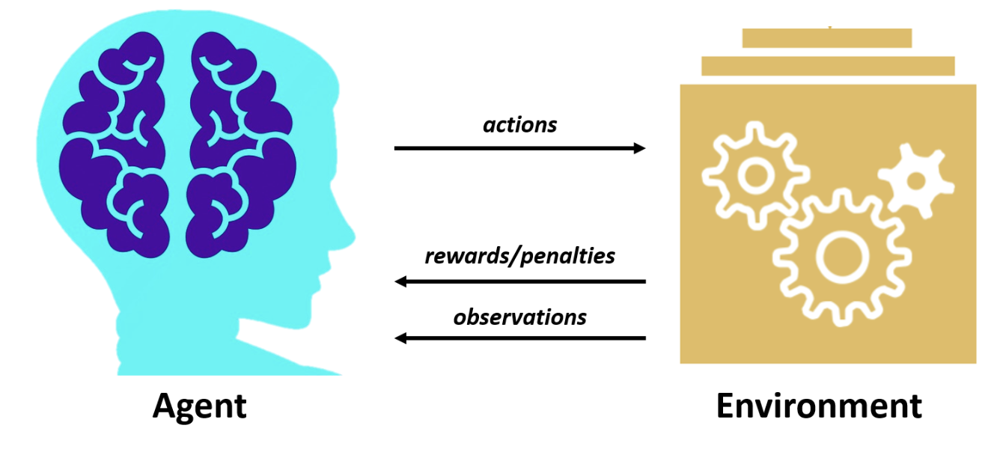
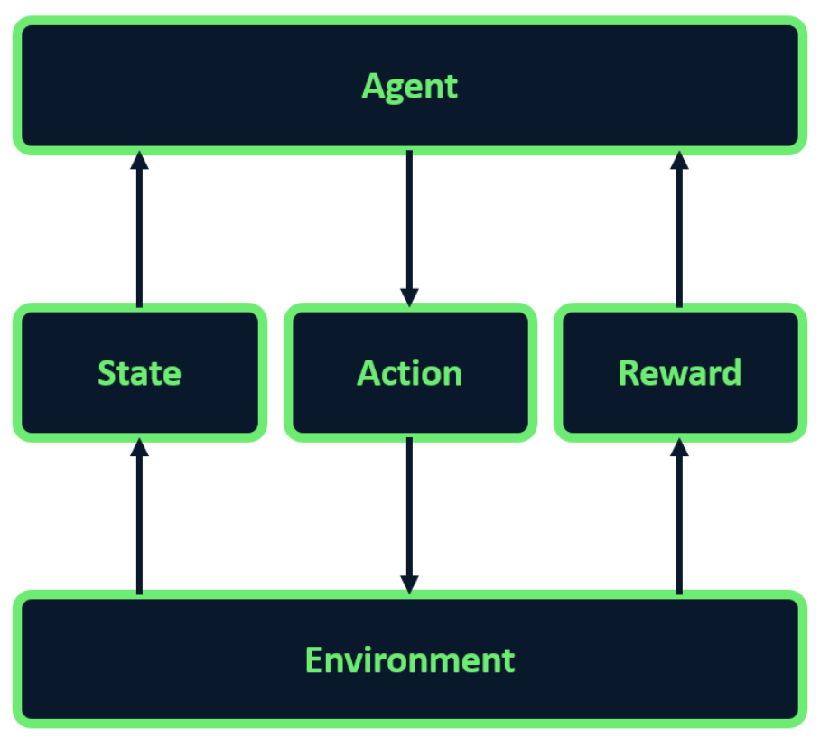
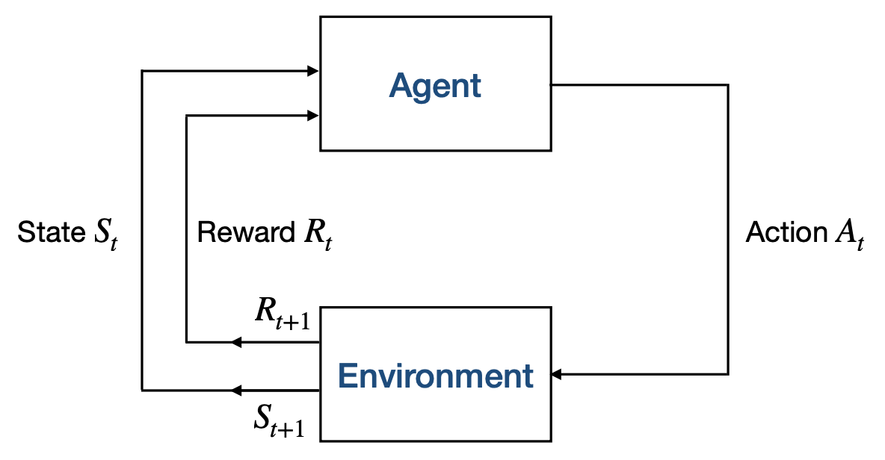
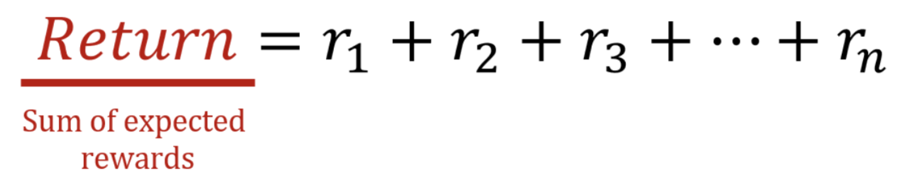
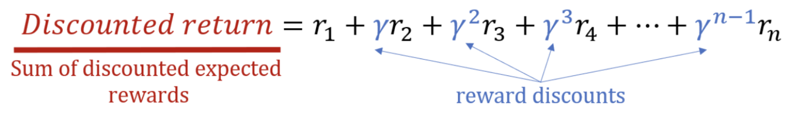
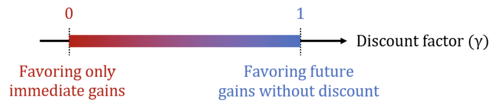
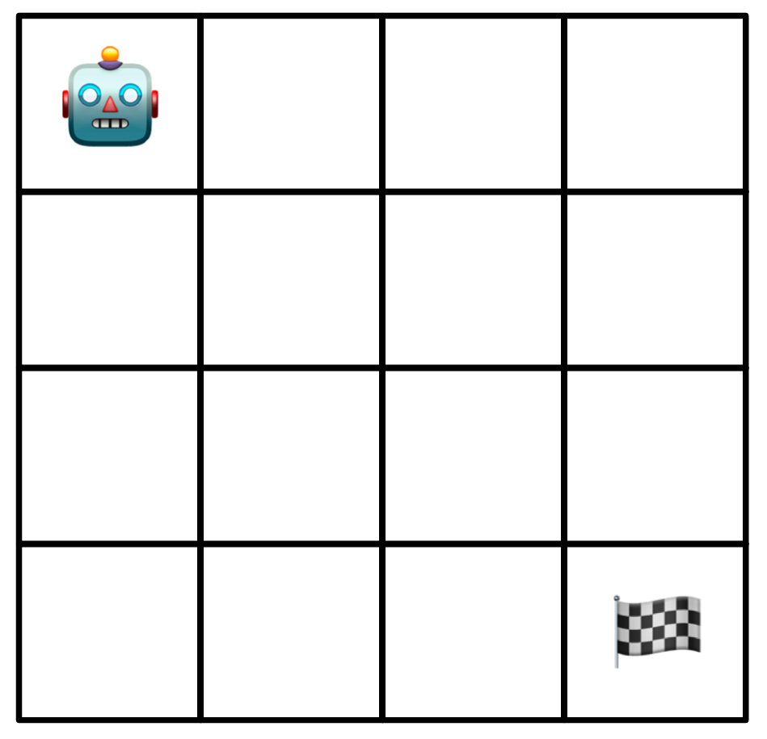
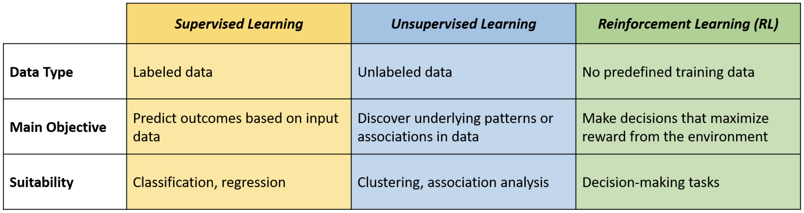
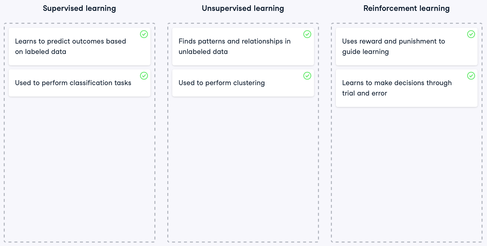
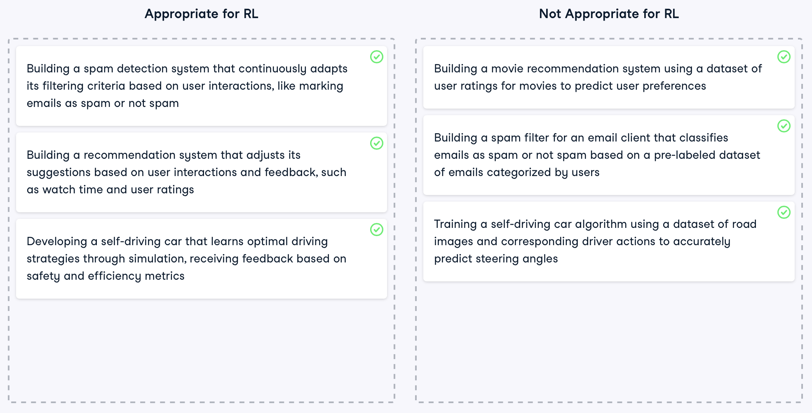

- Key idea: a natural way of thinking about learning is learning through **interaction** with the external world.

    - <u>Learning from interation</u> is a foundational idea underlying nearly all theories of learning and intelligence.

- Reinforcement learning is <u>learning while acting</u> what to do —how to map situations to ***actions***— so as to maximise a ***numerical reward***.

- Differently from supervised learning (see section [Difference between RL and other ML sub-domains](#difference)), reinforcement learning is about <u>how to act and how to explore</u> in order to achieve the **goal**:

    - **Goal-directed** learning from interaction.

    - The learner is not told which actions to take, but instead it must discover which actions yield the most reward by trying them through exploration.

- We want to learn how <u>to map a certain state</u> —what we know about the world, which we use in order to make a decision— <u>to a probability of taking a certain action</u>. This mapping is called a **policy** (see section [Policy](#policy)).

    - A ***state*** can be anything. For example the pixels of Atari, what is displayed on a web page, etc.

    - The **probability** is expressed in terms of <u>maximization of the rewards</u>.


## RL Problem Formulation

The objective of reinforcement learning is to maximise the **cumulative reward** —the sum of the individual rewards obtained at each decision point for each action.

We need to design the RL system in order to map this general framework into the problem that we're trying to solve, so we must define:

1. *Actions*

1. *States*

1. *Rewards*


## Examples of Problems

<p align="center">
    
    
</p>

1. **Go:**

    - *Actions:*  where to place the pieces.
    - *State:*  configuration of the board, represented as a finite matrix of 3 possible values (black, white, empty).

2. **Roomba:**

    - *Actions:*  where to go.
    - *State:*  position of the agent, in a partially observable environment.


## Finite Markov Decision Processes

**Markov Decision Processes** (**MDPs**) are a mathematically idealised formulation of Reinforcement Learning for which precise theoretical statements can be made.

- Tension between breadth of applicability and mathematical tractability.

- MDPs provide a way for framing the problem of learning from experience, and, more specifically, from interacting with an environment.

<h3>Definitions</h3>

Reinforcement Learning, or RL for short, is a unique facet of machine learning where <u>an agent learns to make decisions through trial and error</u>.

Two main entities:

<p align="center">
    
</p>

1. **Agent** = learner and decision-maker.

    - Interacts with the environment selecting ***actions***.
    - ***Observes*** and acts within the environment.
    - Receives:
        - ***rewards*** for good decisions.
        - ***penalties*** for bad decisions.

1. **Environment** = everything else outside the agent.

    - Changes following actions of the agent.

- **Goal**: devise a strategy that <u>maximises the total reward over time</u> .

<h3>RL framework</h3>

- **Agent**: learner, decision-maker.
- **Environment**: challenges to be solved.
- **State**: environment snapshot at given time.
- **Action**: agent's choice in response to state.
- **Reward**: feedback for agent action (positive or negative).

<p align="center">
    
</p>

<h3>RL interaction loop</h3>

- The agent and the environment interact at each discrete step of a sequence $t=0,1,2,3,\dots$

- At each time step $t$, the agent receives some representation of the environment **state** $S_t \in \mathcal{S}$ where $\mathcal{S}$ is the set of the states.

- On that basis, an agent selects an **action** $A_t \in \mathcal{A}(S_t)$ where $\mathcal{A}(S_t)$ is the set of the actions that can be taken in state $S_t$.

- At time $t+1$, as a consequence of its action, the agent receives a **reward** $R_{t+1} \in \mathcal{R}$, where $\mathcal{R}$ is the set of rewards (expressed as real numbers).

<p align="center">
    
</p>

Let's demonstrate the agent-environment interaction using a generic code example. The process starts by creating an environment and retrieving the initial state. The agent then enters a loop where it selects an action based on the current state in each iteration. After executing the action, the environment provides feedback in the form of a new state and a reward. Finally, the agent updates its knowledge based on the state, action, and reward it received.

```{python}
#| eval: false
env = create_environment()
state = env_get_initial_state()

for i in range(n_iterations):
    action = choose_action(state)
    state, reward = env_execute(action)
    update_knowledge(state, action, reward)
```


## Goals and Rewards

- The goal of the agent is formalised in terms of the reward it receives.

- At each time step, the reward is a simple number $R_t \in \mathbb{R}$ (scalar, real number).

- Informally, the agent's goal is to maximise the **total amount** it receives.

- The agent should not maximise the immediate reward, but the **cumulative reward**.

<h3>The Reward Hypothesis</h3>

We can formalise the goal of an agent by stating the "reward hypothesis":

> All of what we mean by goals and purposes can be well thought of as the maximisation of the expected value of the cumulative sum of a received scalar signal (reward).

<h3>Expected Returns</h3>

We will now try to conceptualize the idea of **cumulative rewards** more formally.

In RL, actions carry long-term consequences, impacting both immediate and future rewards. The agent's goal goes beyond maximizing immediate gains; it receives a sequence of rewards and it strives to accumulate the highest *total reward over time*. This leads us to a key concept in RL: the **expected return**.

> The ***expected return*** $G_t$ is a function of the reward sequence $R_{t+1}, R_{t+2}, R_{t+3}, \dots$
>
>> $G_t$ is the sum of all rewards the agent expects to accumulate throughout its journey.

<p align="center">
    
</p>

Accordingly, the agent learns to anticipate the sequence of actions that will yield the highest possible return.

<h3>Episodic Tasks and Continuing Tasks</h3>

In RL, we encounter two types of tasks: *episodic* and *continuous*.

Episodic tasks are those in which we can identify a final step of the sequence of rewards, i.e. in which the interaction between the agent and the environment can be broken into sub-sequences that we call ***episodes*** (such as play of a game, rpeeated tasks, etc.). For example, in a chess game played by an agent, each game constitutes an episode; once a game concludes, the environment resets for the next one.

> An ***episodic task*** is divided into distinct episodes, each with a defined beginning and end.
>
>> Each *episode* ends in terminal state after $T$ steps, followed by a reset to a standard starting state or to a sample of a distribution of starting states.
> 
>> The *next episode* is completely independent from the previous one.

On the other hand, continuing tasks involve ***ongoing interaction*** without distinct episodes (e.g. ongoing process control or robots with a long-lifespan). A typical example is an agent continuously adjusting traffic lights in a city to optimize flow.

> A ***continuing task*** is one in which it is not possible to identify a final state.

<h3>Expected Return for Episodic Tasks and Continuing Tasks</h3>

> In the case of ***episodic tasks*** the ***expected return*** associated to the selection of an action $A_t$ is the sum of rewards defined as follows:
> 
>> $G_t \doteq R_{t+1} + R_{t+2} + R_{t+3} + \dots + R_T$

> In the case of ***continuing tasks*** the ***expected return*** associated to the selection of an action $A_t$ is defined as follows:
>
>> $G_t \doteq R_{t+1} + \gamma R_{t+2} + \gamma^2 R_{t+3} + \dots  = \sum_{k=0}^\infty \gamma^k R_{t+k+1}$
>
> where $\gamma$ is the discount rate, with $0 \leq \gamma \leq 1$.

<h3>Discounting Rewards</h3>

The definition of expected return that we used for episodic tasks would be problematic for continuing tasks: the expected return of time of termination $\mathbf{T}$ would be equal to $\infty$ in some cases, such as when the reward is equal to 1 at each time step.

Immediate rewards are typically valued more than future ones, leading to the concept of **discounted return**. This concept prioritizes more recent rewards by multiplying each reward by a **discount rate**, $\gamma$, raised to the power of its respective time step.

The discount rate determines the ***present value of future rewards**:* a reward received $k$ time steps in the future is worth $\gamma^{k-1}$ what it would be worth if it were received immediately.
For example, for expected rewards $r_1$ through $r_n$, the discounted return would be calculated as:

<p align="center">
    
</p>

The discount factor, ranging between 0 and 1, is crucial for balancing immediate and long-term rewards. A lower gamma value leads the agent to prioritize immediate gains, while a higher value emphasizes long-term benefits. At the extremes, a gamma of zero means the agent focuses solely on immediate rewards, while a gamma of one considers future rewards as equally important, applying no discount.

<p align="center">
    
</p>

<h4>Numerical example:</h4>

In this example, we'll demonstrate how to calculate the discounted return from an array of `expected_rewards`. We define a `discount_factor` of 0.9, then create an array of discounts, where each element corresponds to the discount factor raised to the power of the reward's position in the sequence.

```{python}
import numpy as np
expected_rewards = np.array([1, 6, 3])
discount_factor = 0.9
discounts = np.array([discount_factor ** i for i in range(len(expected_rewards))])
print(f"Discounts: {discounts}")
```

As we can see, discounts decrease over time, giving less importance to future rewards. Next, we multiply each reward by its corresponding discount and sum the results to compute the `discounted_return`, which is 8.83 in this example.

```{python}
discounted_return = np.sum(expected_rewards * discounts)
print(f"The discounted return is {discounted_return}")
```

<h3>Relation between Returns at Successive Time Steps</h3>

> Returns at successive time steps are related to each others as follows:
>
>> $G_t \doteq R_{t+1} + \gamma R_{t+2} + \gamma^2 R_{t+3} + \gamma^3 R_{t+4} + \dots$<br>
>> $\quad\;\; = R_{t+1} + \gamma (R_{t+1} + \gamma R_{t+3} + \gamma^2 R_{t+4} + \dots )$<br>
>> $\quad\;\; = R_{t+1} + \gamma G_{t+1}$


## Policies and Value Functions

Almost all reinforcement learning algorithms involve estimating value
functions, i.e., functions of states (or of state-action pairs) that
estimate how good it is for the agent to be in a given state (or how
good it is to perform a given action in a given state).

A policy is used to model the behaviour of the agent based on the
previous experience and the rewards (and consequently the expected
returns) an agent received in the past.

### Policy {.unnumbered #policy}

Formally, a *policy* is a mapping from states to probabilities of each possible action, i.e. policy $\pi$ is a *probability distribution*.

> If the agent is following ***policy*** $\mathbf\pi$ at time $t$, then
>
>> $\pi(a \vert s)$ is the probability that $A_t = a$ if $S_t = s$

<h3>State-Value Function</h3>

The value function of a state $s$ under a policy $\pi$, denoted $v_\pi(s)$, is the expected return when starting in $s$ and following $\pi$ thereafter.

> For MDPs, we can define the ***state-value function*** $v_\pi$ for policy $\pi$ formally as:
> 
>> $v_s \doteq E_\pi[G_t \vert S_t = s] = E_\pi [\sum_{k=0}^{\infty} \gamma^k R_{t+k+1} \vert S_t = s]$
> 
> for all $s \in \mathcal{S}$.
> 
> where $E_\pi[.]$ denotes the expected value of a random variable, given that the agent follows $\pi$ and $t$ is any time step. The value of the terminal state is 0.

```{python}
#| eval: false
choose = rand(0.1)
if choose >= 0.7:
    move left
else:
	move right
```

<h3>Action-Value Function</h3>

Similarly to the state-value function, we define the action-value function.

> The ***action-value function***, i.e. the value of taking action $a$ in state $s$ under a policy $\pi$, denoted $q_\pi (s,a)$, as the expected return starting from $s$, taking the action $a$, and thereafter following policy $\pi$:
>
>> $q_\pi(s,a) \doteq E_\pi[G_t \vert S_t = s, A_t = a] = E_\pi[\sum_{k=0}^{\infty} \gamma^k R_{t+k+1} \vert S_t = s, A_t = a]$


## Choosing the Rewards

When we model a real system as a Reinforcement Learning problem, the hardest problem is to select the right rewards.

> The **reward** should tell the agent if the current step is a *step forward towards the final goal* or not.

1. Typically, we use negative values for actions that do not help us in reaching our goal and positive if they do (and sometimes we set the values to 0 if they do not help us in reaching the goal).

1. An alternative is to set the values of rewards to a negative number until we reach our goal (and we set the value to 0 when we reach our goal).

It is very important to keep in mind that <u>we should not “reward” the intermediate steps</u> or the single actions.
We are not “teaching” the agent how to execute an intermediate step, but how to reach the final goal. If we do so, the agent will learn how to reach the intermediate step, not the final goal, (e.g., how to execute a sub-task).

Sometimes it's not possible to know the reward until the end of an episode. The typical example is a board game (Chess, Go, etc.).

- This is usually called ***credit assignment problem***, i.e. the problem of assigning a reward to each step.

- In that case the reward might be assigned, for instance, at the end of a **Montecarlo rollout** (stochastic estimate of the reward).

- Example: if the game is successful, we can use $+1$ as reward for all the steps that leads to the victory ($-1$ otherwise).

<h3>Examples of Rewards</h3>

<h4>Gridworld example:</h4>

<p align="center">
    
    $\Rightarrow
    \begin{bmatrix}
        1 & 0 & 0 & 0 \\
        0 & 0 & 0 & 0 \\
        0 & 0 & 0 & 0 \\
        0 & 0 & 0 & 2
    \end{bmatrix}$
    <br>
    <em>**State**</em>
</p>
<p align="center">
    $A = \{R, L, U, D\}$
    <br>
    <em>**Actions**: right, left, up, down</em>
</p>
<p align="center">
    $-1$ to penalize a long path
    <br>
    $0$ when reaching the goal
    <br>
    <em>**Rewards** (given at each action)</em>
</p>

<h4>Maze example:</h4>

<p align="center">
    
</p>
<p align="center">
    $-1$ for no exit
    <br>
    $0$ for exit
    <br>
    <em>**Rewards**</em>
</p>

<h4>Chess example:</h4>

<p align="center">
    
</p>
<p align="center">
    $+1$ for victory
    <br>
    $-1$ for defeat
    <br>
    <em>**Rewards**</em>
</p>

- In games like Go or Chess, the reward in the **terminal state** (i.e. the state at time $T$, the end of the game) is typically $1$ for a win and $-1$ for a loss. However, the outcome is only revealed at the end of the game.

- Therefore, the reward can be assigned only at the end of an episode.

- In Go or Chess, we can for example assing $1$ or $-1$ to each step in case of victory or loss at the end of the episode after a Montecarlo playout/rollout.

<iframe src="papers/2__1__Steps_Toward_Artificial_Intelligence.pdf" width="100%" height="400px"></iframe>


## Estimating Value (State-Value and Action-Value) Functions

If the behaviour of the MDP is known (i.e. the transitions probabilities between all the states are known), the state function or the action-state function can be estimated by considering all the possible moves.

This is not possible when:

- The transitions probabilities are not know.
- The system is very complex (for example a board game has a very large number of potential game configurations).

<h3>Monte-Carlo Methods</h3>

Alternatively, the state-value function $v_\pi$ and the action-value function $q_\pi$ can be estimated through experience.

- One possibility is to keep average values of the actual returns that have followed a certain state (or a certaina action) while following a policy $\pi$. These values will converge to the actual state-value function $v_\pi$ and the action-value function $\_\pi$ asymptotically.

> These methods based on averaging sample returns are referred to as ***Monte Carlo methods***.

<h3>Using function approximators (Neural Networks and Deep RL)</h3>

Monte Carlo methods are not appropriate in case the number of states is very large.

- In this case, it is not practical to keep separate averages for each state individually.

- Instead, $v_\pi$ and $q_\pi$ are maintained as parametrised functions with the number of parameters << number of states.

Various function approximators of different complexity are possible.

- Artificial neural networks are a possible option as function approximators $\rightarrow$ Deep Reinforcement Learning.


## Optimal Policies and Optimal Value Functions

<h3>Optimal Policies</h3>

Solving a reinforcemente learning is roughly equivalent to finding a policy that maximises the amount of reward over the long run.

In finite MDPs there is always at least one policy that is better or equal to all the other policies: this is called ***optimal policy***.

> Although there may be more than one, we denote all the **optimal policies** with $\mathbf{\pi_*}$. They are characterised by the <u>same value function</u> $v_*$ defined as
>
>> $v_*(s) \doteq max_\pi v_\pi(s)$
>
> for all $s \in \mathcal{S}$.

<h3>Optimal Value Functions</h3>

> Optimal policies also share the same ***optimal action-value function*** $q_*$, which is defined as
>
>> $q_* \doteq max_\pi q_\pi(s,a)$
>
> for all $s \in \mathcal{S}$ and $a \in \mathcal{A}(s)$.

> We can write $q_*$ in terms of $v_*$ as follows:
>
>> q_*(s,a) = E[R_{t+1} + \gamma v_*(S_{t+1}) \vert S_t = s, A_t = a]


## Difference between RL and other ML sub-domains {#difference}

RL differs significantly from other types of machine learning, such as supervised and unsupervised learning.

In ***supervised learning***, models are trained using labeled data, learning to predict outcomes based on examples. It is suitable for solving problems like classification and regression.

***Unsupervised learning***, on the other hand, involves learning to identify patterns or structures from unlabeled data. It is suitable for solving problems like clustering or association analysis.

***Reinforcement Learning***, distinct from both, does not use any training data, and learns through trial and error to perform actions that maximize the reward, making it ideal for decision-making tasks.

<p align="center">
    
</p>

<h3>RL vs. Supervised Learning</h3>

*Supervised learning* is learning from a set of labeled examples and, in interactive problems, it is hard to obtain labels in the first place.
Therefore, in "unknown" situations, agents have to learn from their experience. In these situations *Reinforcement learning* is most beneficial.

<h3>RL vs. Unsupervised Learning</h3>

*Unsupervised learning* is learning from datasets containing unlabelled data. Since RL does not rely on examples (labels) of correct behaviour and instead explored and learns it, we may think that RL is a type of unsupervised learning.
However, this is not the case because in *Reinforcement Learning* the goal is to maximise a reward signal instead of trying to find a hidden structure.

For this reason, *Reinforcement Learning* is usually considred a third paradigm in addition to supervised and unsupervised learning.

<p align="center">
    
</p>


## When to use RL

In particular, RL is well-suited for scenarios that require training a model to make sequential decisions where each decision influences future observations. In this setting, the agent learns through rewards and penalties. These guide it towards developing more effective strategies without any kind of direct supervision.

- Sequential decision-making

    - Decisions influence future observations

- Learning through rewards and penalties

    - No direct supervision

<h3>Appropriate vs. Inappropriate for RL</h3>

An appropriate example for RL is **playing video games**, where the player needs to make sequential decisions such as jumping over obstacles or avoiding enemies. The player learns and improves by trial and error, receiving points for successful actions and losing lives for mistakes. The goal is to maximize the score by learning the best strategies to overcome the game's challenges.


- Player makes sequential decisions.
- Receives points and loses lives depending on actions.

Conversely, RL is unsuitable for tasks such as **in-game object recognition**, where the objective is to identify and classify elements like characters or items in a video frame. This task does not involve sequential decision-making or interaction with an environment. Instead, supervised learning, which employs labeled data to train models in recognizing and categorizing objects, proves more effective for this purpose.


- No sequential decision-making.
- No interaction with an environment.

<p align="center">
    
</p>


## RL Applications

Beyond its well-known use in gaming, RL has a myriad of applications across various sectors.

<p style="display: flex; justify-content: space-around; align-items: center;">
    
    
    
    
</p>

1. **Robotics.** In robotics, RL is pivotal for teaching robots tasks through trial and error, like walking or object manipulation.

    - Robot walking
    - Object manipulation

1. **Finance.** The finance industry leverages RL for optimizing trading and investment strategies to maximize profit.

    - Optimizing trading and investment
    - Maximise profit

1. **Autonomous Vehicles.** RL is also instrumental in advancing autonomous vehicle technology, enhancing the safety and efficiency of self-driving cars, and minimizing accident risks.

    - Enhancing safety and efficiency
    - Minimising accident risks

1. **Chatbot development.** Additionally, RL is revolutionizing the way chatbots learn, enhancing their conversational skills. This leads to more accurate responses over time, thereby improving user experiences.

    - Enhancing conversational skills
    - Improving user experiences


## References

The notation and definitions are taken (with small variations) from:

- @sutton2018