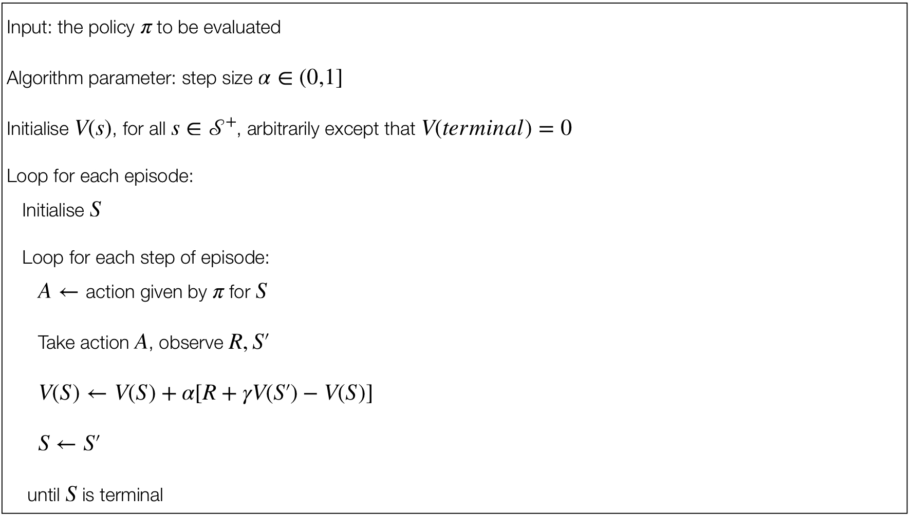
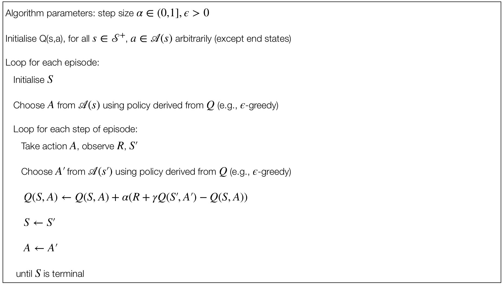
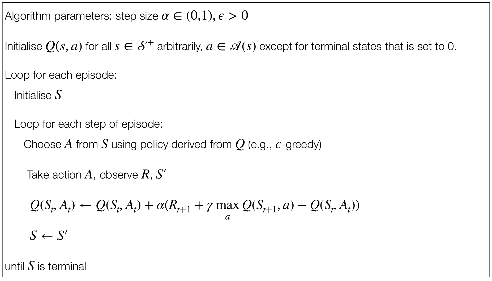

- Like Monte Carlo methods, TD methods can learn directly from experience.

- Unlike Monte Carlo methods, TD methods update estimates based in part on other learned estimates, without waiting for the final outcome (we say that "they ***bootstrap***").

<h3>Three key RL problems</h3>

1. The **prediction problem**: the estimation of $v_\pi$ and $q_\pi$ for a fixed policy $\pi$.

1. The **policy improvement problem**: the estimation of $v_\pi$ and $q_\pi$ while trying at the same time to improve the policy $\pi$.

1. The **control problem**: the estimation of an optimal policy $\pi_*$.

<h3>TD Prediction vs. TD Control</h3>

- We will consider the problem of prediction (**TD prediction**) first (i.e., we fix a policy $\pi$ and we try to estimate the value $v_\pi$ for that given policy).

- Then we will consider the problem of finding an optimal policy (**TD control**).


## TD Prediction

<h3>Monte Carlo vs. TD for Prediction</h3>

- Both TD and Monte Carlo methods for the prediciton problem are based on experience.

- Roughly speaking, **Monte Carlo** methods wait until the return following the visit is known, then use that return as a target for $V(S(t))$.

    > An every-visit Monte Carlo method suitable for non-stationary environment is:
    >
    >> $V(S_t) \leftarrow V(S_t) + \alpha (G_t - V(S_t))$
    >
    > where $G_t$ is the actual return following time $t$ and $\alpha$ is a constant size parameter. This is not based on the average values but on a weighted average (we can get the average if we consider instead $\frac{1}{n}$ as step-size parameter).

- **Monte Carlo** methods must wait until the end of the episode to determine the increment to $V(S(t))$, because only at that point it is possible to calculate $G(t)$.

- **TD** methods instead need to wait only until the next step.

    - At time $t+1$ they immediately make a useful update from a target using the observed reward $R_{t+1}$ and the estimate $V(S_{t+1})$.

<h3>TD(0) Updates</h3>

> The TD(0) method is based on the following **update**:
>
>> $V(S_t) \leftarrow V(S_t) + \alpha(R_{t+1} + \gamma V(S_{t+1}) - V(S_t))$
>
> on transition to $S_{t+1}$ and receiving $R_{t+1}$.
>
> This method is also called ***1-step TD***.

- Essentially, the target for the Monte Carlo update is $G_t$, whereas the target for the TD update is $R_{t+1} + \gamma V(S_{t+1})$.

<h3>TD(0)</h3>

<p align="center">
    
</p>

<h3>TD Error and Interpretation</h3>

Note that the quantity in brackets in the TD(0) update is a sort of error, measuring the difference between the estimated vlaue of $S_t$ and the better estimate $R_{t+1} + \gamma V(S{t+1})$.

> The ***TD error*** is defined as:
>
>> $\delta_t \doteq R_{t+1} + \gamma V(S_{t+1}) - V(S_t)$
>
> The TD error at each time is the error in the estimate *made at that time*.

It is interesting to note that, since the TD error depends on the next state and net reward, it is not actually available until on time step later.

- In other words, $\delta_t$ is the error in $V(S_t)$ available at a time $t+1$.

<h3>Advantages of TD Prediction Methods</h3>

- Compared to ***Dynamic Programming methods***, TD methods do not require a model of the environment, of its reward and next-state proability distributions.

- Compared to ***Monte Carlo methods***, TD methods are implemented in an online, fully incremental fashion.

    - With Monte Carlo methods, one must wait until the end of an episode (i.e. when the return is known), instead with TD methods, we need to wait only one time step.

    - Why does this matter?
        - Some applications have very long episodes.
        - Some applications are actually continuing tasks.

<h3>Theoretical Basis of TD(0)</h3>

Even if the learnig process happens step-by-step, we have convergence guarantees supporting the mthods presented in the lecture[^1].

[^1]: See sections 6.2 and 9.4 of @sutton2018.

More precisely, for any fixed policy $\pi$, TD(0) has been proved to converge to $v_\pi$, in the mean for a constant step-size parameter if it is suffiicently small, and with probability 1 if the step-size decreases given stochastic approximation conditions[^2].

[^2]: See section 2.7 of @sutton2018.

But what is the faster in terms of convergence between dynamic programming, Monte Carlo and TD?

$\quad \blacktriangleright$ This is still an open question, suitable as a reserach topic!


## On-Policy and Off-Policy Control

We assume the following definitions:

> ***On-policy control**:* the agent learns and updates its policy **using** the rewards obtained by the actions selected by means of the policy itself.

> ***On-policy control**:* the agent learns and updates its policy **not using** the rewards obtained by the actions selected by means of the policy itself.


## Sarsa: On-Policy TD Control

We now consider the use of TD prediction methods for the control problem.

For an **on-policy method**, we must estimate $q_\pi(s,a)$ for the current behaviour policy $\pi$ and for all the states $s$ and actions $a$.

<h3>State-Action Pairs Transitions</h3>

- Above, we considered the transitions <u>from state to state</u> and we learned the values of states.

- Now we consider the transitions <u>from state-action pair to state-action pair</u> and learn the values of state-action pair.

Formally, these cases are identical: they are both Markov chain with a reward process.

<h3>Sarsa Updates</h3>

The theorems assuring the convergence of state values under TD(0) also apply to the corresponding algorihtm for aciton values:

>> $Q(S_t, A_t) \leftarrow Q(S_t, A_t) + \alpha (R_{t+1} + \gamma Q(S_{t+1}, A_{t+1}) - Q(S_t,A_t))$
>
> This **update** is done after every transition from a non-terminal state $S_t$.
>
> - If $S_{t+1}$ is terminal, then $Q(S_{t+1}, A_{t+1}) \leftarrow 0$.

<h3>Online TD(0) Control</h3>

The update of Sarsa uses all the elements of the quintuple:

$$(S_t, A_t, R_{t+1}, S_{t+1}, A_{t+1})$$

- This indicates a transition from a state to the next.

- This quintuple gives rise to the name ***Sarsa***.

We can deisng an on-policy control algorithm based on the Sarsa prediction method.

- As in all on-policy methods, we continually estimate $q_\pi$ for the behaviour policy $\pi$.

- At the same time, we assume a greedy policy using $Q$ values.

    - By doing so we will have a convergence of the $Q$ values to $q_*$.

<h3>SARSA</h3>

<p align="center">
    
</p>


## Q-Learning: Off-Policy TD Control

<h3>Q-Learning Algorithm and Updates</h3>

Q-Learning is one of the classis RL algorithms.

It is an off-policy TD control algorithm, defined by:

>> $Q(S_t, A_t) \leftarrow Q(S_t, A_t) + \alpha (R_{t+1} + \gamma \max_{a}Q(S_{t+1},a) - Q(S_t, A_t))$
>
> In this case, the learned action-value function $Q$ directly approximates $q_*$, the optimal action-value function, independent of the plicy being folowed.

<h3>Convergence Properties</h3>

- Policy still matters since it determines which state-action pairs are visited/updated. However, only requirements for convergence is that all pairs continue to be updated.

- Early convergence proofs.

<iframe src="papers/4__1__Learning_from_Delayed_Rewards.pdf" width="100%" height="400px"></iframe>

<iframe src="papers/4__2__Technical_Note_Q-Learning.pdf" width="100%" height="400px"></iframe>

<h3>Q-Learning</h3>

<p align="center">
    
</p>


## Exercises

<h4>Gridworld with Sarsa.</h4>

> Solve the gridworld problem with Sarsa.
>
> [REINFROCEjs - GridWorld: TD](https://cs.stanford.edu/people/karpathy/reinforcejs/gridworld_td.html)

```{python}
#| eval: false
import numpy as np
import random
import copy


# ENVIRONMENT
class GridWorld:
    def __init__(self, size):
        self.size = size
        self.goalPos = [size - 1, size -1]
        self.reset()

    def reset(self):
        """
        Reset the environment for a new episode
        """
        self.agentPos = [0, 0]
        grid = np.full((size, size), '0', dtype=str)
        grid[self.agentPos[0], self.agentPos[1]] = '🤖'
        grid[self.goalPos[0], self.goalPos[1]] = '🏁'
        self.grid = grid
    
    def getState(self):
        return self.agentPos[0], self.agentPos[1]

    def printGrid(self):
        for i, cell in enumerate(self.grid.flatten()):
            if i % self.size == 0:
                print()
            if cell == '🤖':
                print(f'{cell} ', end = '')
            else:
                print(f'{cell}  ', end = '')
        print()

    def _isInsideBoundary(self, pos):
        """
        Check if the given position is inside the grid boundaries
        """
        return 0 <= pos[0] < self.size and 0 <= pos[1] < self.size

    def nextStep(self, a):
        nextPos = copy.deepcopy(self.agentPos)

        match a:
            case 'u':
                nextPos[1] -= 1
            case 'd':
                nextPos[1] += 1
            case 'r':
                nextPos[0] += 1
            case 'l':
                nextPos[0] -= 1
            case _:
                return

        if self._isInsideBoundary(nextPos):  # if not inside boundary, the action is not executed
            self.grid[self.agentPos[1], self.agentPos[0]] = '0'
            self.grid[nextPos[1], nextPos[0]] = '🤖'
            self.agentPos = nextPos

        self.printGrid()

        if self.agentPos == self.goalPos:
            return 0  # goal reached
        else:
            return -1  # still moving


# ROBOT
class Agent:
    def __init__(self, size, nActions, eps, alpha=0.1, gamma=0.9):
        self.Q = np.random.uniform(0, 1, (size, size, nActions))  # Q-table
        self.eps = eps  # exploration rate
        self.alpha = alpha  # learning rate
        self.gamma = gamma  # discount factor
        self.actions = ['u', 'd', 'r', 'l']  # 4 possible actions
        self.printQTable()

    def printQTable(self):
        for x in range(size):
            for y in range(size):
                print(f"Q[{x}, {y}] = {self.Q[x, y]}")
        print()

    def _epsilonGreedy(self, Qs):
        """
        Pick a random action with probability eps
        Pick the best action with high probability
        """
        if random.random() < 1 - self.eps:
            return np.argmax(Qs)
        else:
            return random.randint(0, len(Qs) - 1)

    def chooseAction(self, s_x, s_y):
        """
        Choose an action based on the current state
        """
        actionIdx = self._epsilonGreedy(self.Q[s_x, s_y])
        return actionIdx, self.actions[actionIdx]

    def update(self, s, a, r, s_next, a_next):
        x, y = s # current state
        x_next, y_next = s_next # next state
        a_idx, _ = a 
        a_next_idx, _ = a_next
        
        td_target = r + self.gamma * self.Q[x_next, y_next, a_next_idx]
        td_error = td_target - self.Q[x, y, a_idx]
        self.Q[x, y, a_idx] += self.alpha * td_error


# EXAMPLE USAGE
size, nActions = 7, 4
env = GridWorld(size)
agent = Agent(size, nActions, eps=0.1)
episodes_steps = {}

# Loop for each episode
num_episodes = 10
for episode in range(1, num_episodes + 1):
    print(f"--- Episode {episode} ---")
    env.reset()
    env.printGrid()

    s = env.getState()
    a = agent.chooseAction(s[0], s[1])

    # Loop for each step of episode
    step_idx = 1
    while env.getState() != (size - 1, size - 1):
        print()
        print(f"Episode {episode}, Step {step_idx}:")

        r = env.nextStep(a[1])
        s_next = env.getState()
        a_next = agent.chooseAction(s_next[0], s_next[1])

        agent.update(s, a, r, s_next, a_next)
        s, a = s_next, a_next
        step_idx += 1

    episodes_steps[f"Episode {episode}"] = f"{step_idx - 1} steps"

    for i in range(5):
        print()

for episode, steps in episodes_steps.items():
    print(f"{episode}: {steps}")
```

<h4>Gridworld with Q-Learning.</h4>

> Solve the gridworld problem with Q-Learning.


## Summary

<h3>Recap of TD Methods</h3>

The methods introduced in the lectures are among the most-used methods is RL.
These methods are usually referred to as ***tabular methods***, since the state-action space can fit in a table.

- Table with 1 row per state-action entry.

- What happens if we can't fit all the state-action entries in a table?

    - We need *function approximation* rather than tables (see [Chapter 6](sec6.qmd)).


## References

- **Chapter 6** of @sutton2018