## Recap: What's Wrong with Tabular Methods

Tabular methods suffer form a series of **drawbacks**:

- Table with 1 row per state-action entry.

- What happens if we can't fit all the state-action entries in a table?

    - We need *function approximation* rather than tables.

## Function Approximation in RL

An alternative is ***function approximation***.

Function approximation will provide a ***mapping*** between a state or state-action to a value function.

More precisely:

> A ***value-function approximation*** is a function that takes in input the state (or the state and action), and gives as output the value function for the state (or the state and action).

    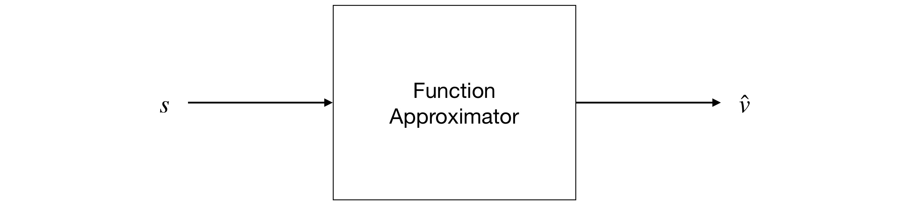
    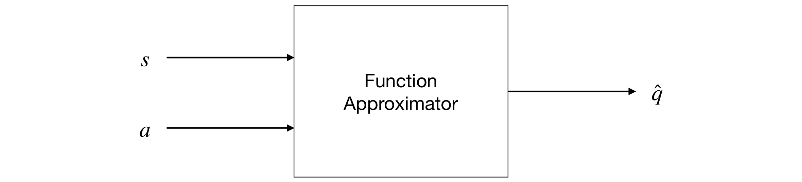
    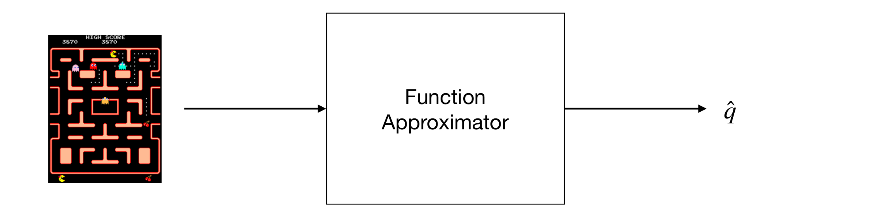
    <em>State = Pixels</em>  
    
    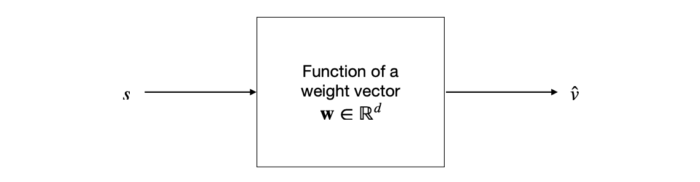

## Approximation Methods

In this chapter we will focus on the study of function approximation for estimating state-value functions.

In particular, we will consider an approach where the approximate value function is represented not as a table but as a parametrised functional form wit weight vector $w \in \mathbb{R}^d$.

We will start by considering how to approximate $v_\pi$ from experience generatd using a policy $\pi$.

    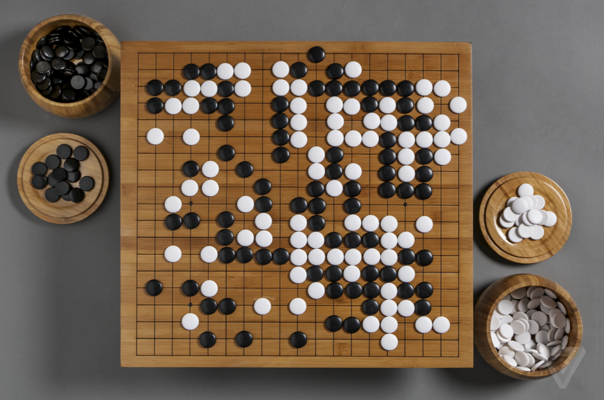

    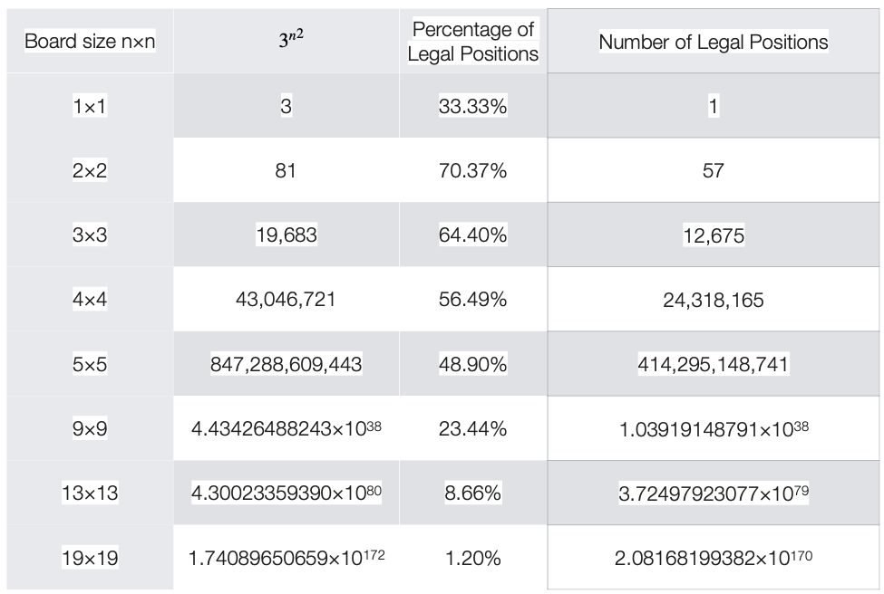 
    <em>Number of Moves in Go.</em>

<iframe src="papers/6__1__Combinatorics_of_Go.pdf" width="100%" height="600px"></iframe>

    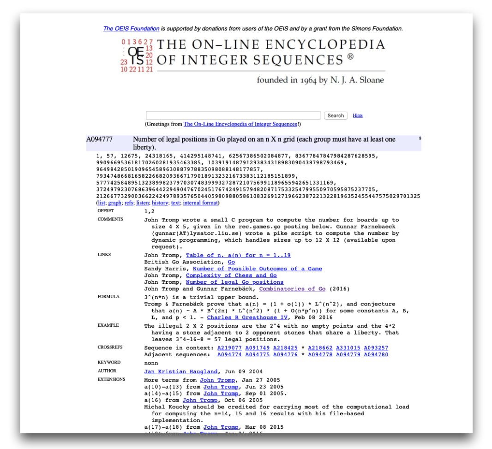 
    <em>[The on-line encyclopedia of integer sequences: Number of legal positions in Go played on an n X n grid (each group must have at least one liberty).](https://oeis.org/search?q=number+of+legal+positions+in+Go&language=english&go=Search)</em>

- We will write $\hat{v}(s,\mathrm{w}) \approx v_\pi(s)$ for the approximate value of state $s$ given weight vector $\mathrm{w}$.

- $\hat{v}$ in theory might be a linear function of the weights $\mathrm{w}$, but more generally it can be a non-linear function.

- A widely used technique is to use a multi-layer artificial neural network to compute $\hat{v}$, with $\mathrm{w}$ the vector of the connection weights in all the layers.

    - By adjusting the values of the weights $\mathrm{w}$, a different range of functions can be computed by the network.

        > Typically, the number of weights $\mathrm{w}$ is much less than the number of states
        >
        >> $(d \ll \vert \mathcal{S} \vert)$
        >
        > where $\vert \mathcal{S} \vert$ is the cardinality of the states of the system under consideration.

- There are various interesting aspects that need to be considered:

    1. Function approximation can be used also for partially observable problems.
    1. With an approximation, we might build a function that does not depend on certain aspects of the state and we can just build a fucnction assuming that they are not observable.

## Value Function Approximation

Classic methods are based on the idea of an ***update "towards" a target***. For example:

- In the **Monte Carlo** method the update target for the value prediction is

    > $G_t$.

- In the **TD(0)** the update target is

    > $R_{t+1} + \gamma \hat{v} (S_{t+1}, \mathrm{w}_t)$

In classic methods, what we do is to change the current estimation value "towards" the **update**.

The estimation of value function approximation is different:

- Very complex methods are possible.

- We will use supervised learning (i.e. we will learn through sets of inputs-outputs).

    - Since we are trying to learn how to link the inputs to real values, we can consider this as a function approximation problem.

## Nonlinear Function Approximation: Artificial Neural Networks

*Artificial Neural Networks (ANN)* are widely used for **nonlinear function approximation**.

We have results that guarantee that an ANN with a single hidden layer containing a large enough finite number of sigmoid units can approximate any continuous function on a compact region of the network's input space to any degree of accuracy (see *Cybenko 1989*).

Nowadays, we tend to use networks with more than one hidden layer (we usually use the term *deep learning* for that reason).

Learning is based on **stochastic gradient descent**.

<iframe src="papers/6__2__Approximation_by_Superpositions_of_a_Sigmoidal_Function.pdf" width="100%" height="400px"></iframe>

## Stochastic Gradient Descent

*Stochastic gradient descent methods (SGD)* adjust the weights after each example by small value in the direction that would most reduce the error on that example.

We will discuss here the case for one example, but this can be done for multiple examples at a time (remember mini-batch gradient descent methods).

- Remember the formula we used for the ***update of the weight*** for a deep learning network (valid for a "shallow" artificial neural network as well):

    >> $w_j \leftarrow w_j + \nabla w_j = w_j - \eta \frac{\delta J}{\delta w_j}$
    >
    > We will indicate time here, since we are updating $w_j$ at each of a series of discrete time steps $t=0,1,2,\dots$ as follows:
    >
    >> $w_{j, t+1} \leftarrow w_{j,t} + \nabla w_{j,t} = w_{j,t} - \eta \frac{\delta J}{\delta w_{j,t}}$

- Assuming that we have a ***loss function*** that represents the *mean squared error* (which we call ***mean square error***) as follows:

    > $J(\mathrm{w}) = \sum_{s \in \mathcal{S}} (U_t - \hat{v}(S_t, \mathrm{w}_t))^2$

- We will obtain the following

    >> $\mathrm{w}_{t+1} \doteq \mathrm{w}_t - \frac{1}{2} \eta \nabla [U_t - \hat{v} (S_t, \mathrm{w}_t)]^2$ 
    >> $\qquad \; = \mathrm{w}_t + \eta [U_t - \hat{v} (S_t, \mathrm{w}_t)] \nabla \hat{v}(S_t, \mathrm{w}_t)$
    >
    > where $U_t$ is the target and $\eta$ is the step-size parameter.

- Recall the definition of ***gradient***:

    > $\nabla f(\mathrm{w}) \doteq (\frac{\delta f(\mathrm{w})}{\delta \mathrm{w}_1}, \frac{\delta f(\mathrm{w})}{\delta \mathrm{w}_2}, \cdots, \frac{\delta f(\mathrm{w})}{\delta \mathrm{w}_d})$

- **Stochastic gradient methods** are "gradient descente" methods because the overall step in $\mathrm{w}_t$ is proportional to the negative gradient of the example's squared error.

    - <u>Intuition:</u> tha is the direction in which the error falls more rapidly.
    - <u>Recall:</u> they are stochastic since they are besed on samples that are ranodmly chosen.

## Semi-gradient One-step Sarsa Prediction

We can extend the mathematical framework we discussed for state value functions to state-action value functions.

- In this case the target $U_t$ is an approximation of $q_\pi(S_t, A_t)$.

- The general gradient-descent update for action-value prediction is:

    > $\mathrm{w}_{t+1} = \mathrm{w}_t + \eta [U_t - \hat{q}(S_t, A_t, \mathrm{w}_t)] \nabla \hat{q} (S_t, A_t, \mathrm{w}_t)$

- For example, the update for the ***(episodic) semi-gradient one-step Sarsa method*** is the following:

    > $\mathrm{w}_{t+1} \doteq \mathrm{w}_t + \eta [R_{t+1} + \gamma \hat{q} (S_{t+1}, A_{t+1}, \mathrm{w}_t) - \hat{q}(S_t, A_t, \mathrm{w}_t)] \nabla \hat{q}(S_t, A_t, \mathrm{w}_t)$

    It is called ***semi-gradient*** because we are not really taking the "real" gradient. The "real" gradient will require to calculate the gradient of $U_t$.

    The main reason why we are not calculating the gradient of $U_t$ is **complexity**. Additionally, convergence is guaranteed also in this case: for a constant policy, this method converges in the same way that TD(0) does.

## Semi-gradient One-step Sarsa Control

But, as usual, we are interested in the ***problem of control***, i.e. we are interested in finding the **optimal policy**.

- The method is essentially the same as for tabular methods.

    > For each possible action $a$ available in the current state $S_t$, we can compute $\hat{q}(S_t, a, \mathrm{w}_t)$ and then find the greedy action using:
    >
    >> $A^*_t = \arg \max_a \hat{q} (S_t, a, \mathrm{w}_t)$

- Policy tratment is then done by changing the estimation policy to a soft approximation of the greedy policy (e.g. $\epsilon$-greedy policy).

- Actions are selected according to this same policy (this is ***on-policy control***).

    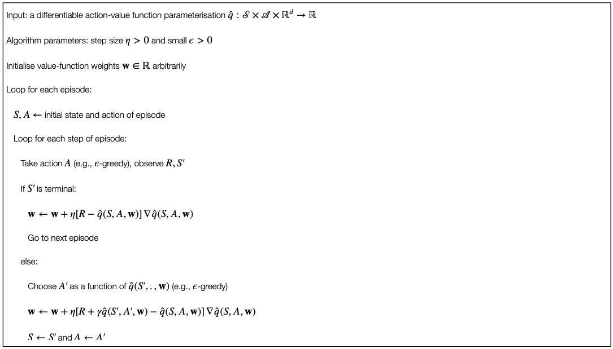

## Semi-gradient Q-Learning

The basic procedure is similar for the "classic" Q-learning.

- The update is as follows:

    >> $\mathrm{w}_{t+1} = \mathrm{w}_t + \eta [R_{t+1} + \gamma \max_a \hat{q} (S_{t+1},a,\mathrm{w}_t) - \hat{q} (S_t, A_t, \mathrm{w}_t)] \nabla \hat{q} (S_t, A_t, \mathrm{w}_t)$
    >
    > where $\mathrm{w}_t$ is the vector of the network's weights, $A_t$ is the action selected at time $t$, and $S_t$ and $S_{t+1}$ are respectively the inputs to the network at time steps $t$ and $t+1$.

## Deep Q-Network (DQN)

**Semi-gradient Q-learning** is at the basis of the ***Deep-Q-Network (DQN)*** used for implementing the agent. We can actually use the two terms interchangeably.

- It combines Q-learning with a deep (convolutional) multi-layer network.

- The gradient is based on backpropagation.

- DQN's reward is calculated as follows:

    - $+1$ whenever the score of the game is increased;

    - $-1$ whenever the score of the game is decreased;

    - $0$ otherwise.

- In other words, the positive (and negative) values were capped to $+1$ (and $-1$).

<h3>States and Actions</h3>

    
    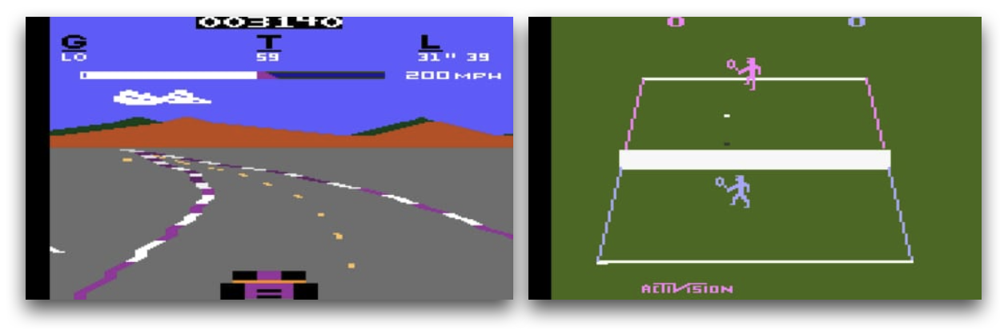 
    <em>210 $\times$ 160 pixel image frames with 128 colours at 60Hz.</em>

The **Atari games** have a resolution of $210 \times 160$ pixel image frames with $128$ colours at $60$ Hz.

- Data were pre-processed in order to obtain a $84 \times 84$ array of luminanc values.

- Because the full states of many of the Atari games are not completely observable from the images frames and to provide more information to the agent for the decision, the authors "stacked" the four most recent frames so that the inputs of the network has dimension $84 \times 84 \times 4$.

    - Otherwise we would have ended up with a 1-order Markov system with the current image as state (no directionality for example, etc.).

<iframe src="papers/1__2__Playing_Atari_with_Deep_Reinforcement_Learning.pdf" width="100%" height="400px"></iframe>

    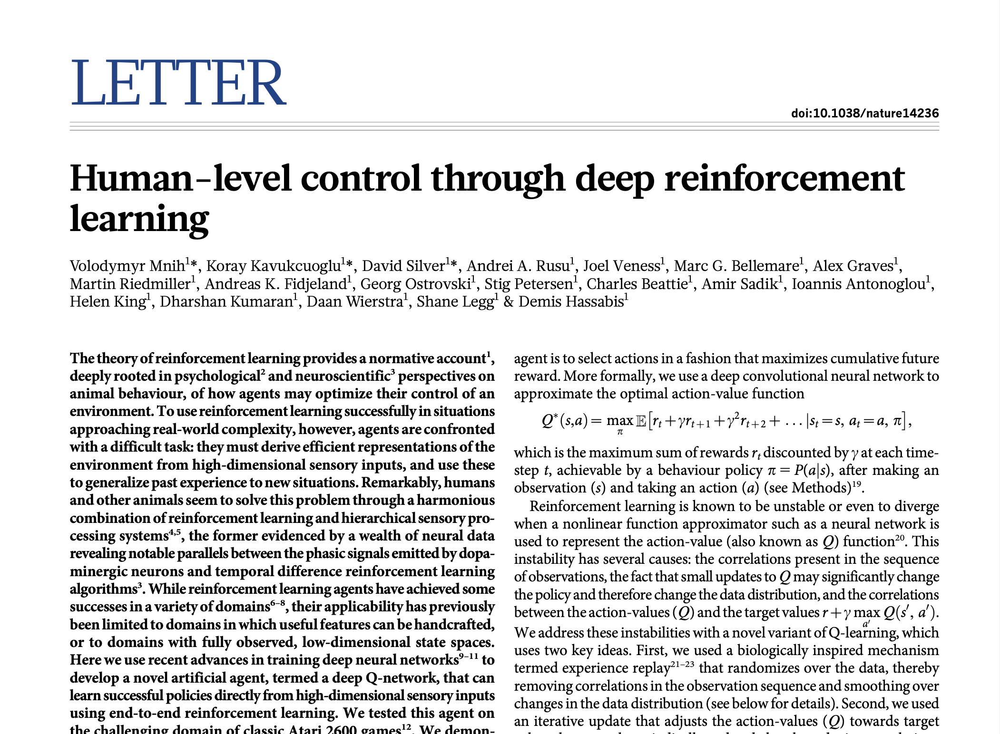

- The activation levels of DQN's outputs are the estimated optimal values of the corresponding state-value pairs fiven the stack of images in input.

- The assignment of output units to a game's actions varied from game to game (from 4 to 18).

    - Not in all the games the output values are actually considered (but they are still in the network).

    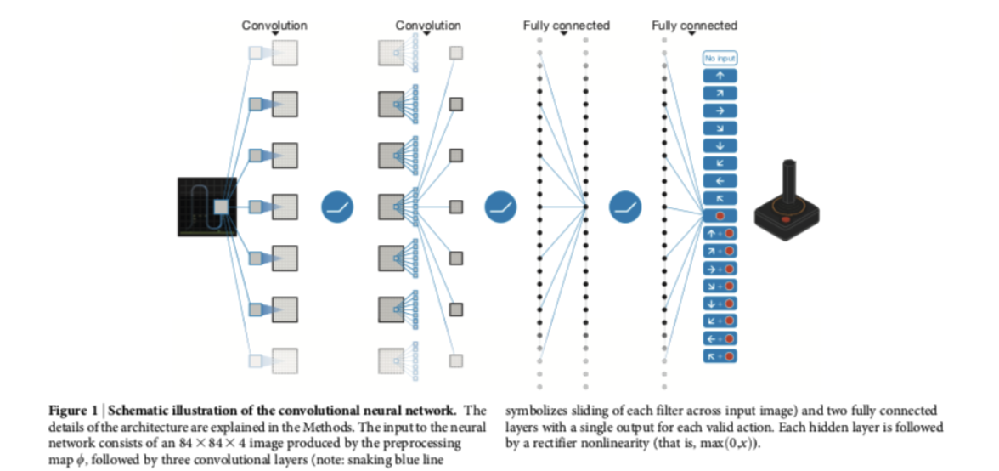

<h3>Deep Q-Network</h3>

**DQN** uses an $\epsilon-$greedy policy, with $\epsilon$ decreasing linearly over the first million frames and remaining at a low value for the rest of the learning session.

- The network is trained using a *mini-batch stochastic gradient descent* after processing 32 images (and previous 3 for each image).

    - Changes proportional to the running average to the magnitudes of recent gradients for that weight (RSMProp).

- A key modification to standard Q-learning is the use of *experience replay*.

    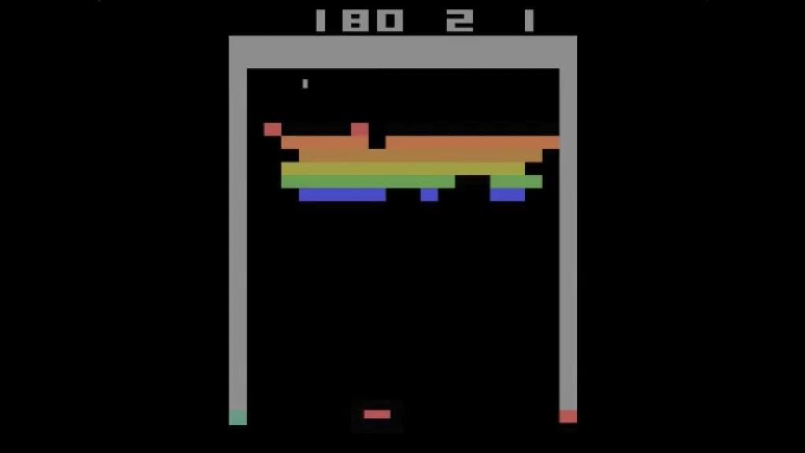 
    <em>[DQN Breakout.](https://youtu.be/TmPfTpjtdgg?si=FGcNv-nZK3s__oiS)</em>

<h3>Experience Replay</h3>

In DQN the authors made a series of changes to the standard basic Q-learning.
First, they used a method called ***experience replay*** in order to deal with the convergence problem of Q-learning.

- In Q-learning, if the updates are highly correlated, the larning process converges very slowly.

- The key idea of experience replay is to store agent's experience in a **replay memory** (or ***replay buffer***) that is accessed to perform the weight updates.

1. The training is done through an emulator.

1. After the emulator executes action $A_t$ in a state represented by image stack $S_t$ and returned reward $R_{t+1}$ and the folliwing image tack $S_{t+1}$, it added the tuple $(S_t, A_t, R_{t+1}, S_{t+1})$ to the replay memory.

1. The experience replay memory accumulates experiences over many plays of the same game.

1. Each Q-learning update is performed by randomly samling from the experience replay buffer.

<iframe src="papers/6__3__Self-Improving_Reactive_Agents_Based_On_Reinforcement_Learning_Planning_and_Teaching.pdf" width="100%" height="400px"></iframe>

- Instead of $S_{t+1}$ becoming the new $S_t$ for the next update, as it would be in the usual Q-learning, a new unconnected experience is drawn from the replay memory.

    - <u>Important point:</u> since Q-learning is an off-policy algorithm, id does not need to learn from "connected" trajectories.

- The random selection of uncorrelated "experiences" reduce the variance of the update. This allows Q-learning to converge more quickly.

    $\blacktriangleright$ Dealing with the variance of the update is a key issue for RL and it is an active ara of research.

    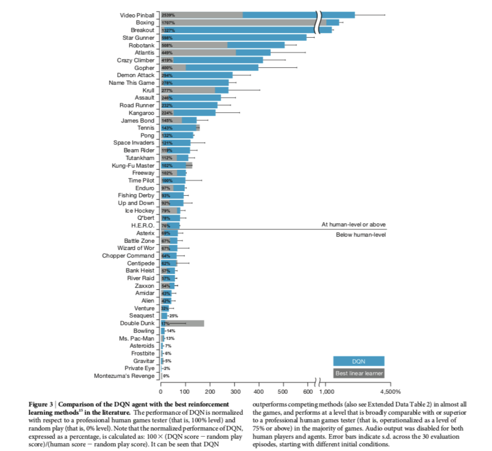

## References

- **Chapters 9 and 16** of @sutton2018