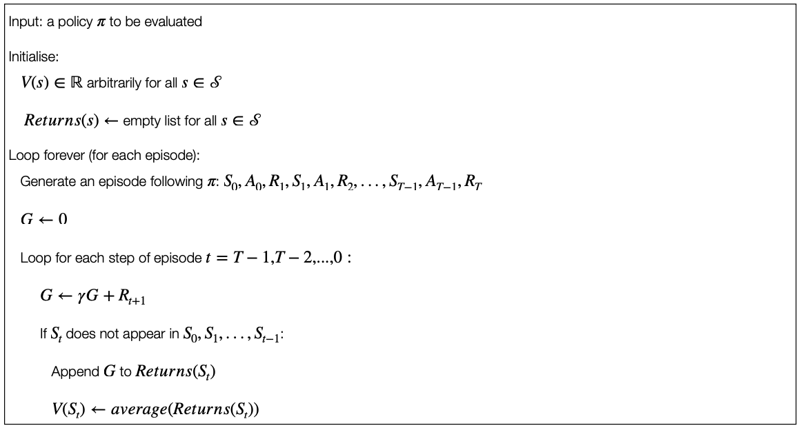
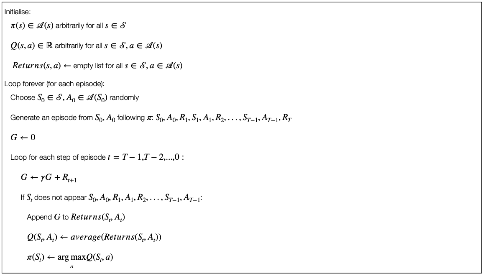

> ***Monte Carlo methods*** are ways of solving the reinforcement learning problems based on averaging the sample returns.

- We focus on ***episodic tasks***.

    - Only on the completion of episodes are values estimates and policies changed.

- Monte Carlo methods <u>sample and average *returns*</u> for each state-action pair much like the multi-armed bandits methods and <u>average *rewards*</u> for each action.

    - However, we now consider multiple states.
    - The return after taking an action in one state depends on the actions taken in later states in the same episodes.
    - In other words: this is ***the full reinforcement learning problem***.

- If we have the full knowledge of the MDP we can compute the value functions (see Bellman equation, dynamic programming).

- We assume that we do not have full knowledge of the underlying MDP.

    - This is the general case because the underlying dynamics and characteristics of the system are unknown (e.g. robot esploration) or because the system is too complex (e.g. games).

- Since we do not have full knowledge, we need to ***learn the value functions***.

<h3>Three key RL problems</h3>

1. The **prediction problem**: the estimation of $v_\pi$ and $q_\pi$ for a fixed policy $\pi$.

2. The **policy improvement problem**: the estimation of $v_\pi$ and $q_pi$ while trying at the same time to improve the policy $\pi$.

3. The **control problem**: the estimation of an optimal policy $\pi_*$.

## Monte Carlo Prediction

- **Goal**: learning the state-value function for a given policy.

    Recall:

    > The ***value of a state*** is the expected return (expected cumulative guture discounted reward) from that state.

- **Obvious/simple solution**: average the returns observed after visiting that state. As more returns are observed, the average should converge to the expected value.

    More formally:

    > We want to estimate $v_\pi(s)$, the value of a state $s$ under policy $\pi$, given a set of episodes obtained by following $\pi$ and passing through $s$.
    >
    >> Each occurrence of a state $s$ in an episode is called a ***visit*** to $s$.
    >
    >> A state $s$ can be visited multiple times.
    >
    >> The first time a state $s$ is visited in an episode is called the ***first visit*** to $s$.

> - The **first-visit Monte Carlo method** estimates $v_\pi(s)$ as the average of the returns following first visits to $s$.
>
> - The **every-visit Monte Carlo method** averages the returns following all the visits to $s$.

Borh *first-visit Monte Carlo* and *every-visit Monte Carlo* converge to $v_\pi(s)$ as the number of visits (or first visits) to $s$ goes to infinity.

<h3>First-visit Monte Carlo Prediction</h3>

    

<h3>Multi-visit Monte Carlo Prediction</h3>

Every-visit Monte Carlo would be the same except without the check for $S_t$ having occurred earlier in the episode.

## Monte Carlo Estimation of Action Values

The **estimation of a state value** makes sense when we have a model of the system.

- With a model, state values alone are sufficient to determine a policy.

- Without a model, it is necessary to estimate the value of each action in order for the value to be useful in suggesting a policy.

>> The ***policy evaluation problem*** for action values is to estimate $q_\pi(s,a)$, the expected return when starting in state $s$, taking action $a$ and then following policy $\pi$.
>
> <u>Remember:</u> we assume that the policy $\pi$ is fixed.

The methods for the Monte Carlo estimation of action values are essentially the same as those presented for state value, but now we talk about visits to the state-action pair instead of to a state.

> A state-action pair $s,a$ is said to be ***visited in an episode*** if the state $s$ is visited and the action $a$ is taken in it.

> The ***first-visit Monte Carlo method*** averages the returns following the first time in each episode that the state was visited and the action was selected.

## Maintaining Exploration

However, there is a problem: <u>many state-action pairs might never be visited</u>.

- If $\pi$ is a deterministic policy, then in following $\pi$, we will observe returns only for one of the actions of each state.

    - No return to average $\rightarrow$ no improvement with experience.

    - We cannot compare alternatives, because no alternatives are explored.

- To compare alternatives, we need to estimate the value of all the actions from each state, not only the one we currently prefer (according to our policy).

    - This is the general ***problem of maintaining exploration***.

    - One way to do this is to have the episodes starting in a state-action pair and that every pair has non-zero probability of being seelcted as start.

    - This ensures that asymptotically (infinite number of episodes), all the state-action pairs will be visited an infinite number of times.

## On-policy and Off-policy Exploration

The method described above is useful, but it cannot applied in general.

- Think about, for example, the case where we have exploration with the environment. We cannot start by "jumping" to a certain state-action pair at the beginning.

The most common alternative is to ensure that all the state-action pairs are explored anyway.

- We need to explore these states, <u>*not following* the current policy</u> (for example with a stochastic policy). In other words, the exploration is not performed *on-policy* as done until now in this section, but ***off-policy***.

- Various methods are possible, such as ***off-policy prediction via Importance Sampling*** (not covered here - see Chapter 5.5 of @sutton2018).

## Policy Improvement

We will focus now back on on-policy exploration, i.e. the policy is used to make decisions and to explore the vaious states.

Until now we assumed that the policy was fixed. However, the policy itself can be ***improved while learning*** the value functions and, potentially, we might have to aim at obtaining an optimal policy.

> Methods used for improving a policy in order to reach the optimal policy are ususally referred to as ***Monte Carlo control***.

- Remember: until now we've assumed that the policy was fixed.

    - Given that policy, we estimate the value functions.

- Now we consider how to improve the policy starting from an *on-policy method*.

    - The policy that we use to make deicisions is that we are trying to improve. 

- Policy improvement is done by making the policy greedy with respect to the current value functions.

- In this case we have an action-value function.

    - No model is needed to construct the greedy policy.

> For any action-value function $q$, the corresponding ***greedy policy*** is the one that, for each $s \in \mathcal{S}$, deterministically chooses an action with maximal action-value:
>
>> $\pi(s) \leftarrow \arg \max_a Q(s,a)$

We have formula results that ensure that this process of policy improvement lead to optimal policy (usually referred to **Monte Carlo control**).

## Monte Carlo Control with and without Exploring Starts

<h3>Monte Carlo Control without Exploring Starts</h3>

An alternative method for Monte Carlo control (i.e. to achieve the optimal policy) is to use an $\epsilon-$greedy approach.

Most of the time the action that has the maximal estimated action value is chosen, but with a probability $\epsilon$ an action is chosen at random. This means that:

> All the non-greedy actions are given the minimal probability of selection
> $$\frac{\epsilon}{\mathcal{A}(s)}$$

Following this mechanism, it can be guaranteed that we will have an improvement of the policy (**policy improvement theorem**).

<h3>Monte Caro Control with Exploring Starts</h3>

    

## References

- **Chapter 5** of @sutton2018