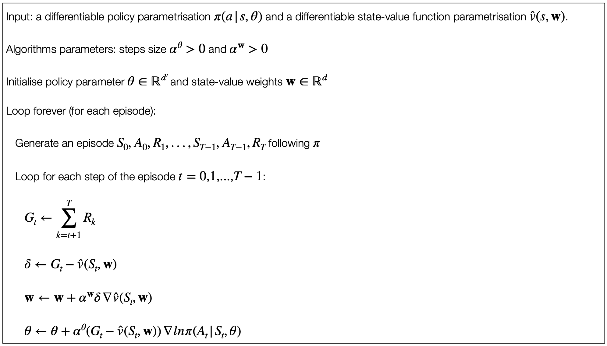

## Issues with REINFORCE

As a stochastic gradient method, REINFORCE has good theoretical convergence properties.

By construction, the expected update over an episode is the same direction as the performance gradient.

- This assumes an improvement in expected performance for sufficient small $\alpha$ and convergence to a local optimum under standard stochastic approximation conditions for decreasing $\alpha$.

- However, since it is a Monte Carlo method, REINFORCE suffers from high variance and this might lead to slow learning.

- One way of dealing with this problem is to use baselines and actor-critic
methods.

## REINFORCE with Baseline

> The policy gradient theorem can be generalised to include a comparison
of the action value to an arbitrary ***baseline $b(s)$***:
> 
>> $\nabla J(\theta) \propto \sum_s \mu(s) \sum_a (q_\pi(s,a) - b(s)) \nabla \pi (a \vert s, \theta)$
>
> The *baseline* can be any function, even a random variable, as long as it does not vary with $\alpha$.
>
> The equation remains valid because the subtracted quantity is zero:
> 
>> $\sum_a b(s) \nabla \pi(a \vert s, \theta) = b(s) \nabla \sum_a \pi(a \vert s, \theta) = b(s) \nabla 1 = 0$

The policy gradient theorem with baseline can be used to derive an update rule using similar steps.

> The update for REINFORCE with baseline is as follows:
>
>> $\theta{t+1} \doteq \theta_t + \alpha(G_t-b(S_t)) \frac{\nabla \pi(A_t\vert S_t, \theta_t)}{\pi(A_t \vert S_t,\theta_t)}$

> $G_t =$
>
> $=$  the cumulative reward that we get from $t$.
>
> $=$  the value of that state for that specific rollout onwards.

    

