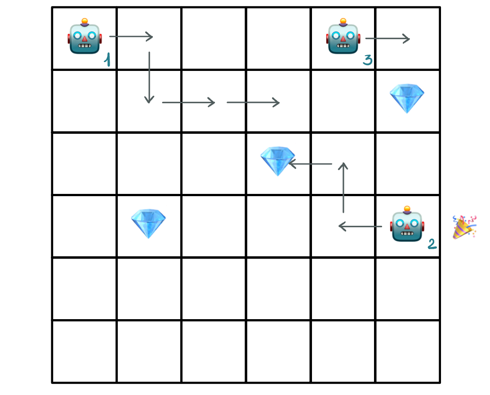
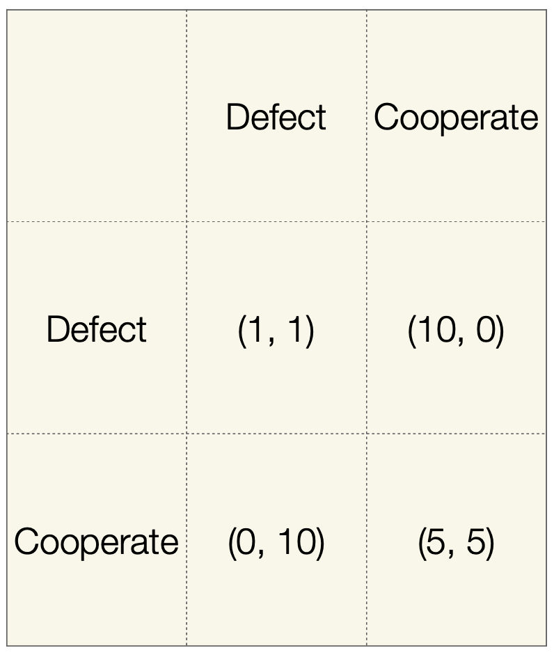

There are several possible definitions of ***multiagent systems**:*

> *Multiagent systems* are distributed systems of independent actors called agents that are each independently controlled but that interact with one another in the same environment.
> 
> $-$ *See @wooldridge2002 and @tuyls2018.*

> *Multiagent systems* are systems that include multiple autonomous entiites with (possibly) diverging information.
>
> $-$ *See @shoham2009.*

## Multiagent Learning

<h3>Definition</h3>

We will use the following definition of ***multiagent learning***:

> *"The study of multiagent systems in which one or more of the autonomous entities improves automatically through experience".*

<h3>Characteristics of Multiagent Learning</h3>

1. Different **scale**:

    - A city or an ant colony or a football team.

1. Different **degree of complexity**:

    - A human, a machine, a mammal or an insect.

1. Different **types of interaction**:

    - Frequent interactions (or not), interactions with a limited number of individuals, etc.

## Presence of Regularity

It is fundamental that there is a certian ***degree of regularity*** in the system otherwise prediction of behaviour is not possible.

> **Assumption:** past experience is somehow predictive of future expectations.

Dealing with **non-stationarityy** is a key problem: it is the usual problem of reinforcement learning at the end.

## Paradigms

We will study 5 paradigms:

1. Online Multi-agent Reinforcement Learning towards individual utility
1. Online Multi-agent Reinforcement Learning towards social welfare
1. Co-evolutionary learning
1. Swarm intelligence
1. Adaptive mechanism design

There are novel emerging paradigms that will discuss during the coming lectures based on foundational models/LLMS, which are being developed right now:

1. Multi-agent Learning based on foundational models towards individual utility
1. Multi-agent Learning based on foundational models towards social welfare

## Online Reinforcement Learning towards Individual Utility/Reward

One of the most-studied scenarios in multiagent learning is that in which multiple independent agents take actions in the same environment and learn online to maximise their own individual utility functions.

> **Goal:** to maximise the utility at the end of the game (i.e. expected reward).

    
     
    <em>Gridworld Example.</em>

From a formal point of view (game-theory point of view), this can be considered a ***repeated normal form game***.

- A **repeated game** is a game that is based on a certain number of repetitions.

- **Normal form games** are games that are presented using a matrix.

    - As aside, an *extensive form game* is a game for which an explicit representation of the sequence of the players' possible moves, their choices at every decision point and the information about other player's move and relative payoffs.

<h3>Example: Prisoner's Dilemma</h3>

The Prisoner’s Dilemma is a classic 2-player game.

> **Description of the game:**
> 
> - Two prisoners committed a crime together and are being interrogated separately.
> 
> - If neither of them confesses to the crime (they both “cooperate”), then
they will both get a small punishment (corresponding to a payoff of 5).
>
> - If one of them confesses (or “defects”), but the other does not, then
the one that confesses gets off for free (payoff of 10), but the other
gets the worst punishment possible (payoff of 0).
>
> - If they both defect, they get a worst punishment (payoff of 1).

    

- Normal games were initially introduced as one-shot game.

- The players know each other’s full utility (reward) functions and play the game only once.

- In this setting, the concept of ***Nash equilibrium***[^1] was introduced: a set of actions such that no player would be better off deviating given that the other player's actions are fixed.

    - Games can have one or multiple Nash equilibria.
    - In the Prisoner’s Dilemma, the only Nash Equilibrium is for both agents to defect.

[^1]: *"A Beautiful Mind":* movie about the life of Nash.

<iframe src="papers/11__1__Moral_Alignment_for_LLM_Agents.pdf" width="100%" height="400px"></iframe>

<em>[https://arxiv.org/abs/2410.01639](https://arxiv.org/abs/2410.01639)</em>

## Repeated Normal Form Games

[^2]

[^2]: *"**M**utual **A**ssured **D**estruction":* .

## Online Reinforcement Learning towards Social Welfare

## Co-evolutionary Approaches

## Evolutionary Algorithms

## Problem of Representation

## Fitness Function

## Selection

## Cross-over

## Mutation

## Evaluation and Replacement

The best individuals are kept in the next generation, by taking the copies.

## Coevolution

We can update the parameters of a policy $\rightarrow$ we mutate the parameters.
The mapping can be a parametric mapping of what we can learn.

## Aside: DNA Computing

